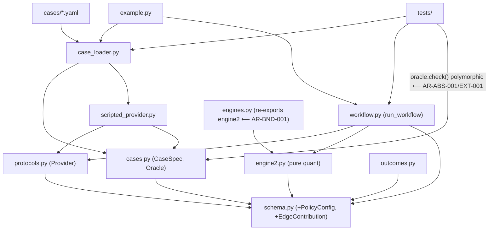

# Engine 2 Hardening + Generic Case System — Design

**Status:** DESIGN ONLY — no implementation. Awaiting gate approval.
**Supersedes (structurally):** `docs/engine2_hardening_design.md` (the spec/why).
**Incorporates:** `reviews/2026_06_06_architecture_review.md` findings
AR-BND-001, AR-ABS-001/002/003, AR-DRY-001, AR-BND-002, AR-TST-001, AR-PAR-001.
**Mode:** extending existing code → changes expressed as diffs to the current
flat `engine/` package, not a new structure.

---

## Phase 1 — Problem framing

### 1.1 Objective
Freeze the Pricing/edge contract by hardening Engine 2 (exact closed-form q,
Monte-Carlo edge with SNR/attribution, uncertainty-propagating fair value) and
make every test case a data file via a generic provider/oracle system.

- **Inputs:** a `CaseSpec` (YAML) — theme sentence, thesis, axis, prior, scenarios
  (`X_s`, `σ_g_s`, `p_s`), expressions, stops, policy, `thesis_sign`, oracle.
- **Outputs:** a populated `ThemeObject` (+ markdown memo) with a hardened
  `Pricing` block; per-case pass/fail `AssertionResult`s from the oracle.
- **Constraints:** pure Python, deterministic, fully typed; add-only schema;
  golden numbers reproduced to 1e-6 before/after every step; MC seeded.
- **Success criteria:** AI-issuance `exact` oracle matches the golden numbers to
  1e-6; French-banks `acceptance` oracle confirms ratio ≈ 1.9 + edge sign +
  attribution; invariants floor passes for every case; `example.py` output
  byte-identical after retrofit.

### 1.5 Mathematical specification (lives as the `engine2.py` module docstring)
- **q (priced-in measure):** `min_q KL(q ‖ prior)` s.t. `Σ q_s f_k(X_s)=c_k`,
  `Σ q_s=1`. Solution = exponential tilt `q_s ∝ prior_s·exp(Σ_k λ_k f_k(X_s))`;
  λ solves the convex dual `min_λ ln Z(λ) − Σ_k λ_k c_k`. K=1 ⇒ `f_1=X, c_1=X_mkt`.
- **edge (identity, deterministic):** `edge_mean = ⟨p − q, X⟩`. MC gives only the
  second moments (`edge_std`, `SNR`, `P(success)`).
- **fair value:** `scenario_fv = Σ p_s X_s`; `Var[X] = Σ p_s σ_g_s² +
  Σ p_s (X_s − scenario_fv)²` (within + between); `scenario_fv_std = √Var[X]`.
- **distributional assumptions (MC):** `X_s ~ N(X_s, σ_g_s)`, `p ~ Dirichlet(κ·p)`.
- **degeneracy conditions (AR-TST-001):** `Var_q[X]=0` (all `X_s` equal) → Newton
  undefined → return `INFEASIBLE`; `min X_s == max X_s` → no interior → `INFEASIBLE`;
  single scenario → trivially `INFEASIBLE` unless `X_mkt==X_0`; MC draws that fall
  outside the drawn span → skip + count `infeasible_fraction`.
- **risk caveat:** q is risk-neutral; `edge_basis="gross_of_risk_premium"` unless a
  pricing kernel `m_s` maps to physical q.

### 1.2 Core abstraction
**`Provider`** — the input-blind seam set the runner depends on. Everything else
orbits it: cases produce a `ScriptedProvider`, the future LLM produces another, and
`run_workflow` cannot tell them apart. Survives the next requirement change (LLM
wiring) because it is defined by *what each engine seam returns*, not by how.

### 1.3 Components

| Component | Single responsibility | Consumes | Consumed by |
|---|---|---|---|
| `engine2.py` | All Engine 2 quant: tilt q, MC edge, fair value (AR-BND-001 single home) | `schema`, numpy/scipy | `workflow`, `engines` (re-export) |
| `protocols.py` | Declare `Provider` as composed narrower seam protocols (AR-ABS-002) | `schema` | `workflow`, `scripted_provider` |
| `cases.py` | `CaseSpec` + discriminated-union `Oracle` models with polymorphic `check()` (AR-ABS-001) | `schema` | `case_loader`, `tests` |
| `case_loader.py` | Read YAML/JSON → `CaseSpec`; resolve `prior` strings (AR-BND-002) | `cases`, `schema` | `tests`, `example` |
| `scripted_provider.py` | One `CaseSpec` → a deterministic `Provider` (AR-BND-002) | `protocols`, `cases` | `workflow`, `tests`, `example` |
| `workflow.py` | Drive a `Provider` + `PolicyConfig` → `ThemeObject` + memo | `protocols`, `engine2`, `engines`, `schema` | `tests`, `example` |
| `outcomes.py` | `ThemeOutcomeRecord` + `append_outcome` (JSONL) | `schema` | (later) backtest analytics |

7 components — at the ceiling, so no further splitting.

---

## Phase 2 — Architecture

### 2.1 Dependency graph (DAG, arrows point toward the domain)



No cycles: `engines.py → engine2.py` is the *only* direction (re-export), resolving
the split-brain back-edge. The test calls `oracle.check(theme)` — no `kind` switch.

### 2.2 Data flow

`cases/*.yaml` → **case_loader** (`load_case`: parse YAML, resolve `prior` →
vector, validate into typed `schema` objects) → `CaseSpec` (in-memory Pydantic) →
**scripted_provider** wraps it → **workflow.run_workflow(provider, policy)** calls
seams in order, calls `engine2.run_pricing` (→ `solve_q_tilt`, `compute_edge_mc`),
`engines.score_expression(…, policy)` → constructs `ThemeObject` (discipline gates
fire) → **oracle.check(theme)** → `list[AssertionResult]` + memo string.

- **Schema at boundaries:** YAML→`CaseSpec`; engine outputs→`Pricing` (now with
  typed `edge_attribution: list[EdgeContribution]`); oracle→`list[AssertionResult]`.
- **Failure modes:** loader raises on schema violation (no silent default); solver
  returns `q_status=INFEASIBLE` (never fabricates q); ThemeObject raises ValueError
  on a discipline-gate failure (unchanged); MC skips+counts infeasible draws.

### 2.3 Parallelisation map
- **Parallel-safe:** MC draws in `compute_edge_mc` (each: sample X & p, re-solve q,
  recompute edge — independent). Mechanism: `concurrent.futures` over chunks **only
  if** each draw gets an independent stream via `numpy.random.SeedSequence(seed)
  .spawn(n)` (AR-PAR-001). Parametrized tests parallel via `pytest-xdist`.
- **Sequential:** the engine seam order in `run_workflow` (true data dependency).
- **Shared state:** none mutable. RNG is the only hazard → child seeds are
  immutable per draw; the sequential path is the bit-identical reference.

### 2.4 / 2.5 Inversion & anti-pattern scan
- *What makes it fail?* (a) a prior-default leak into AI-issuance → guarded by
  explicit per-case `prior`; (b) MC nondeterminism under parallelism → guarded by
  `SeedSequence`; (c) Oracle in an invalid state → eliminated by the discriminated
  union. All three are designed out, not patched later.
- God module: none (>3 in/>3 out). Leaky abstraction: `Pricing` now fully typed
  (no `dict`/DataFrame crossing). Config explosion: gate knobs grouped in
  `PolicyConfig`. Premature generalisation: narrower seam protocols are declared but
  `Provider` composes them — one implementer today, but the composition is free and
  the LLM is a known second use.

---

## Phase 3 — Interfaces

### 3.1 Key protocols & contracts

```python
from __future__ import annotations
from typing import Annotated, Literal, Protocol, Union, runtime_checkable

from pydantic import BaseModel, Field

from .schema import (
    Axis, Expression, PMGate, Risk, Scenario, Sizing, Thesis, ThemeObject,
)
from .stage0 import IngestionResult


# ── AR-ABS-002: Provider as composed narrow seams (ISP) ──────────────────────
class ScenarioSource(Protocol):
    def propose_scenarios(self, thesis: Thesis, axis: Axis) -> list[Scenario]: ...

class ExpressionSource(Protocol):
    def enumerate_expressions(
        self, thesis: Thesis, axis: Axis, scenarios: list[Scenario]
    ) -> list[Expression]: ...

class RiskSource(Protocol):
    def size_and_risk(
        self, thesis: Thesis, axis: Axis, best: Expression, conviction: int
    ) -> "SizingRiskBundle": ...

class Provider(ScenarioSource, ExpressionSource, RiskSource, Protocol):
    """Full pipeline seam. ScriptedProvider and (later) LLMProvider implement it."""
    def parse(self, raw: str) -> IngestionResult: ...
    def extract_drivers(self, statement: str) -> Thesis: ...
    def define_axis(self, thesis: Thesis) -> Axis: ...
    def normal_fair_value(self, axis: Axis) -> float: ...
    def critique(self, theme: ThemeObject) -> list[str]: ...


class SizingRiskBundle(BaseModel):  # AR-ABS-002: replace bare 3-tuple
    sizing: Sizing
    risk: Risk
    pm_gate: PMGate


# ── AR-DRY-001: single source of truth for all gate thresholds ───────────────
class PolicyConfig(BaseModel):
    omega_min: float = 2.0
    liquidity_min: float = 0.40
    cost_fraction_max: float = 0.33
    convexity_weight_a: float = 0.10      # was `a` default in score_expression
    crowding_decay_g: float = 0.50        # was `g`
    snr_min: float = 1.0                  # SNR gate — SEPARATE from the 4 discipline gates


# ── AR-ABS-001: oracle as a discriminated union with polymorphic check ───────
class AssertionResult(BaseModel):
    name: str
    passed: bool
    detail: str = ""

class _OracleBase(BaseModel):
    def check(self, theme: ThemeObject) -> list[AssertionResult]:
        """Always includes the invariants floor; subclasses add their own asserts."""
        ...

class ExactOracle(_OracleBase):
    kind: Literal["exact"] = "exact"
    scenario_fv: float
    q: list[float]
    edge: float
    omega: float
    score: float
    gated_out: list[str]
    tol: float = 1e-6

class RatioTarget(BaseModel):
    target: float
    tol: float

class AcceptanceOracle(_OracleBase):
    kind: Literal["acceptance"] = "acceptance"
    base_worst_ratio: RatioTarget
    edge_sign: Literal["thesis_aligned"] = "thesis_aligned"
    attribution_top: str

class InvariantsOnlyOracle(_OracleBase):
    kind: Literal["invariants_only"] = "invariants_only"

Oracle = Annotated[
    Union[ExactOracle, AcceptanceOracle, InvariantsOnlyOracle],
    Field(discriminator="kind"),
]


# ── AR-ABS-003: typed attribution at the serialisation boundary ──────────────
class EdgeContribution(BaseModel):
    scenario: str
    contribution: float   # (p_s - q_s) * X_s
    disagreement: float   # (p_s - q_s)


# ── engine2 result surface (additive; consumed into Pricing Optional fields) ──
class EdgeMC(BaseModel):
    edge_mean: float                       # == deterministic ⟨p-q,X⟩ (asserted)
    edge_std: float
    snr: float
    p_success: float
    vol_adjusted_edge: float
    direction_ok: bool
    attribution: list[EdgeContribution]
    infeasible_fraction: float


@runtime_checkable
class QSolution(Protocol):
    q: list[float]
    status: Literal["FEASIBLE", "INFEASIBLE"]
    reason: str
```

Key signatures (bodies are TODO at scaffold):

```python
def solve_q_tilt(
    X_s: list[float], constraints: list[tuple], prior: list[float],
) -> QSolution: ...                         # K=1 root-find / K>1 dual Newton + feasibility

def compute_edge_mc(
    p: list[float], X_s: list[float], sigma_g: list[float], X_mkt: float,
    prior: list[float], thesis_sign: Literal[-1, 1], sigma_axis: float,
    n_draws: int = 10_000, kappa: float = 1e6, seed: int = 0,
) -> EdgeMC: ...                            # SeedSequence(seed).spawn(n_draws)

def run_pricing(
    scenarios: list[Scenario], X_mkt: float, normal_fv: float,
    prior: list[float] | None, thesis_sign: Literal[-1, 1],
    policy: PolicyConfig, kernel: list[float] | None = None,
) -> Pricing: ...

def run_workflow(provider: Provider, policy: PolicyConfig) -> tuple[ThemeObject, str]: ...
def load_case(path: str) -> CaseSpec: ...
```

### 3.2 Configuration design
**Approach: Pydantic.** `PolicyConfig`, `CaseSpec`, `Oracle` union, and all result
models are Pydantic (serialisation boundaries / the LLM contract). `cases/*.yaml`
holds data; `policy: "default"` resolves to `PolicyConfig()`. No internal
dataclasses cross a boundary here, so Pydantic throughout.

### 3.3 Error-handling strategy
- **case_loader:** raise on schema violation / unknown `prior` (never default-fill).
- **engine2:** return `INFEASIBLE` status (data condition), raise only on programmer
  error (mismatched lengths). MC: skip+count infeasible draws, never silent-drop.
- **workflow:** discipline gates raise `ValueError` (unchanged contract); propagate.
- **tests:** `oracle.check` returns results; the test asserts all `passed`.

### 3.4 Testing strategy
- **unit (pytest):** `solve_q_tilt` (golden q to 1e-6; K>1; **degeneracies
  AR-TST-001**: all-`X_s`-equal, single scenario, `X_mkt` on boundary, `INFEASIBLE`
  propagation); `compute_edge_mc` (`edge_mean==compute_edge` identity; SeedSequence
  reproducibility — sequential==parallel; `infeasible_fraction` reported); fair
  value (σ=0 ⇒ std=between-only).
- **property (hypothesis):** tilt feasibility ⇔ interior `X_mkt`; q sums to 1, all
  positive; edge sign vs `thesis_sign`.
- **integration (pytest):** parametrized over `cases/*.yaml` → `run_workflow` →
  `oracle.check`; AI-issuance exact, French-banks acceptance, invariants floor all.
- **regression:** AI-issuance golden check run before/after every build step.

---

## Phase 4 — File structure (diff to current flat `engine/`)

```
creditmacro/
├── engine/
│   ├── __init__.py
│   ├── schema.py             # MOD: +Scenario.sigma_g_s/hist_freq; +Pricing Optional
│   │                         #      fields (scenario_fv_std, q_status, edge_std, snr,
│   │                         #      p_success, vol_adjusted_edge, edge_attribution,
│   │                         #      edge_direction_ok, edge_basis, infeasible_fraction);
│   │                         #      +EdgeContribution, +PolicyConfig (or in protocols)
│   ├── engine2.py            # NEW: solve_q_tilt, compute_edge_mc, run_pricing,
│   │                         #      scenario fair value — SINGLE Engine-2 home (AR-BND-001)
│   ├── engines.py            # MOD: re-export run_pricing/compute_edge from engine2;
│   │                         #      score_expression(..., policy: PolicyConfig)  (AR-DRY-001)
│   ├── protocols.py          # NEW: Provider + ScenarioSource/ExpressionSource/RiskSource,
│   │                         #      SizingRiskBundle, QSolution  (AR-ABS-002)
│   ├── cases.py              # NEW: CaseSpec, Oracle union, *Oracle.check, AssertionResult,
│   │                         #      EdgeMC, RatioTarget  (models only — AR-ABS-001/BND-002)
│   ├── case_loader.py        # NEW: load_case + prior resolution  (I/O — AR-BND-002)
│   ├── scripted_provider.py  # NEW: ScriptedProvider(Provider)    (behaviour — AR-BND-002)
│   ├── workflow.py           # NEW: run_workflow(provider, policy) -> (ThemeObject, memo)
│   ├── outcomes.py           # NEW: ThemeOutcomeRecord + append_outcome (JSONL)
│   ├── stage0.py             # unchanged
│   └── example.py            # MOD: load cases/ai_issuance.yaml via ScriptedProvider
├── cases/
│   ├── ai_issuance.yaml      # NEW: oracle.kind=exact, prior=uniform, golden numbers
│   └── french_banks.yaml     # NEW: oracle.kind=acceptance, prior=historical, ratio≈1.9
├── tests/
│   ├── unit/
│   │   ├── test_solve_q_tilt.py
│   │   ├── test_edge_mc.py
│   │   └── test_fair_value.py
│   └── integration/
│       └── test_cases.py     # parametrized over cases/*.yaml; oracle.check()
└── docs/
    ├── engine2_hardening_design.md
    └── engine2_design.md      # this file
```

**Deviation from the shared `src/package_name/` layout:** the project already uses a
flat `engine/` package; per "extending existing code", I keep it rather than impose
`src/`. `PolicyConfig`/`EdgeContribution` may live in `schema.py` (with the rest of
the contract) or `protocols.py` — decide at scaffold; both keep the DAG intact.

---

## Phase 5 — Risks & trade-offs

- **`edge_mean` ≡ point estimate, not MC mean** (deliberate): freezes the golden
  number; SNR is a documented hybrid. Trade-off accepted.
- **`scenario_fv_std` within+between** vs within-only: reporting total; resolve at
  step-3 review. Test A unaffected (Optional, unasserted).
- **Narrow seam protocols declared before the 2nd implementer:** mild YAGNI risk,
  but the LLM provider is a *known* second use and composition is zero-cost.
- **Not doing:** the `g` estimator, calibration analytics, execution, LLM wiring,
  pricing-kernel estimation (only the optional hook).
- **Build order unchanged** from the spec §11 (case system first, prove byte-
  identical, then tilt, FV, MC, outcomes, French-banks, parametrized runner).

---

## Handoff

### File structure

```
creditmacro/
├── engine/
│   ├── __init__.py
│   ├── schema.py             # MOD: add-only Optional fields + EdgeContribution + PolicyConfig
│   ├── engine2.py            # NEW: solve_q_tilt, compute_edge_mc, run_pricing, fair value
│   ├── engines.py            # MOD: re-export engine2 quant; score_expression takes PolicyConfig
│   ├── protocols.py          # NEW: Provider (+ narrow seams), SizingRiskBundle, QSolution
│   ├── cases.py              # NEW: CaseSpec, Oracle union, *Oracle.check, AssertionResult, EdgeMC
│   ├── case_loader.py        # NEW: load_case + prior resolution
│   ├── scripted_provider.py  # NEW: ScriptedProvider(Provider)
│   ├── workflow.py           # NEW: run_workflow(provider, policy)
│   ├── outcomes.py           # NEW: ThemeOutcomeRecord + append_outcome
│   ├── stage0.py             # unchanged
│   └── example.py            # MOD: load cases/ai_issuance.yaml via ScriptedProvider
├── cases/
│   ├── ai_issuance.yaml      # NEW: exact oracle, prior=uniform, golden numbers
│   └── french_banks.yaml     # NEW: acceptance oracle, prior=historical, ratio≈1.9
├── tests/
│   ├── unit/
│   │   ├── test_solve_q_tilt.py
│   │   ├── test_edge_mc.py
│   │   └── test_fair_value.py
│   └── integration/
│       └── test_cases.py
└── docs/
    └── engine2_design.md
```

### Protocols

```python
from __future__ import annotations
from typing import Annotated, Literal, Protocol, Union, runtime_checkable
from pydantic import BaseModel, Field
from .schema import Axis, Expression, PMGate, Risk, Scenario, Sizing, Thesis, ThemeObject
from .stage0 import IngestionResult


class ScenarioSource(Protocol):
    def propose_scenarios(self, thesis: Thesis, axis: Axis) -> list[Scenario]: ...

class ExpressionSource(Protocol):
    def enumerate_expressions(self, thesis: Thesis, axis: Axis, scenarios: list[Scenario]) -> list[Expression]: ...

class RiskSource(Protocol):
    def size_and_risk(self, thesis: Thesis, axis: Axis, best: Expression, conviction: int) -> "SizingRiskBundle": ...

class Provider(ScenarioSource, ExpressionSource, RiskSource, Protocol):
    def parse(self, raw: str) -> IngestionResult: ...
    def extract_drivers(self, statement: str) -> Thesis: ...
    def define_axis(self, thesis: Thesis) -> Axis: ...
    def normal_fair_value(self, axis: Axis) -> float: ...
    def critique(self, theme: ThemeObject) -> list[str]: ...


class SizingRiskBundle(BaseModel):
    sizing: Sizing
    risk: Risk
    pm_gate: PMGate


class PolicyConfig(BaseModel):
    omega_min: float = 2.0
    liquidity_min: float = 0.40
    cost_fraction_max: float = 0.33
    convexity_weight_a: float = 0.10
    crowding_decay_g: float = 0.50
    snr_min: float = 1.0


class AssertionResult(BaseModel):
    name: str
    passed: bool
    detail: str = ""

class _OracleBase(BaseModel):
    def check(self, theme: ThemeObject) -> list[AssertionResult]: ...

class ExactOracle(_OracleBase):
    kind: Literal["exact"] = "exact"
    scenario_fv: float
    q: list[float]
    edge: float
    omega: float
    score: float
    gated_out: list[str]
    tol: float = 1e-6

class RatioTarget(BaseModel):
    target: float
    tol: float

class AcceptanceOracle(_OracleBase):
    kind: Literal["acceptance"] = "acceptance"
    base_worst_ratio: RatioTarget
    edge_sign: Literal["thesis_aligned"] = "thesis_aligned"
    attribution_top: str

class InvariantsOnlyOracle(_OracleBase):
    kind: Literal["invariants_only"] = "invariants_only"

Oracle = Annotated[Union[ExactOracle, AcceptanceOracle, InvariantsOnlyOracle], Field(discriminator="kind")]


class EdgeContribution(BaseModel):
    scenario: str
    contribution: float
    disagreement: float

class EdgeMC(BaseModel):
    edge_mean: float
    edge_std: float
    snr: float
    p_success: float
    vol_adjusted_edge: float
    direction_ok: bool
    attribution: list[EdgeContribution]
    infeasible_fraction: float

@runtime_checkable
class QSolution(Protocol):
    q: list[float]
    status: Literal["FEASIBLE", "INFEASIBLE"]
    reason: str


def solve_q_tilt(X_s: list[float], constraints: list[tuple], prior: list[float]) -> QSolution: ...
def compute_edge_mc(
    p: list[float], X_s: list[float], sigma_g: list[float], X_mkt: float,
    prior: list[float], thesis_sign: Literal[-1, 1], sigma_axis: float,
    n_draws: int = 10_000, kappa: float = 1e6, seed: int = 0,
) -> EdgeMC: ...
def run_workflow(provider: Provider, policy: PolicyConfig) -> tuple[ThemeObject, str]: ...
def load_case(path: str) -> CaseSpec: ...
```

### Config

**Approach: Pydantic.** `PolicyConfig` is the single source of gate thresholds
(AR-DRY-001); `score_expression` takes it as a parameter. `CaseSpec`/`Oracle`/result
models are Pydantic (serialisation + LLM contract). `cases/*.yaml` carries data;
`policy: "default"` → `PolicyConfig()`. New `schema` fields are Optional with inert
defaults (σ=0) so existing data validates and the golden numbers are unchanged.
