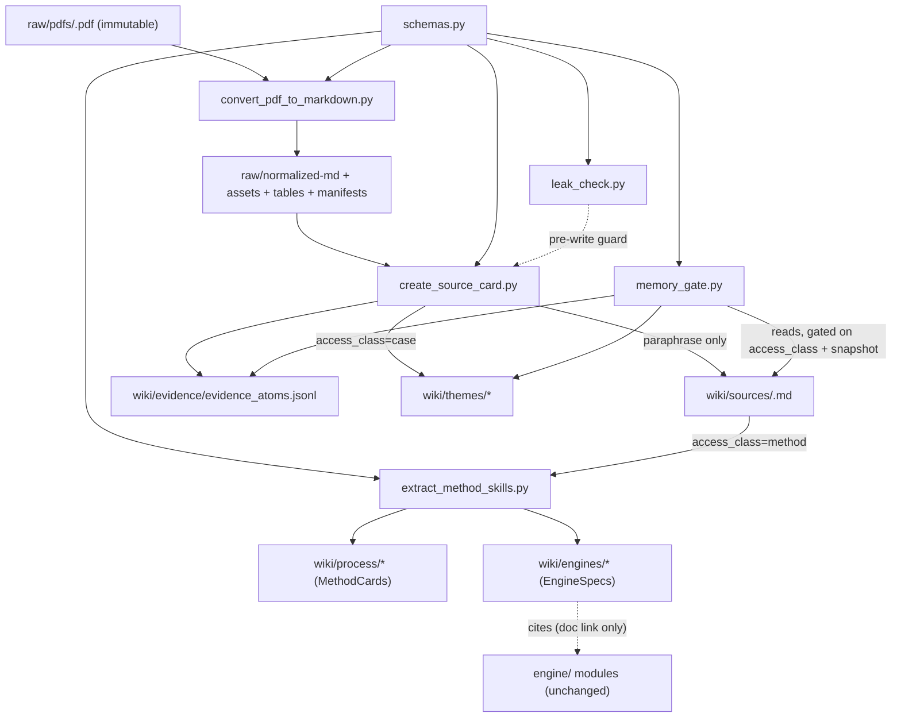

# Source Compiler + Method-Skill Extraction — Design (scaffold-ready)

**Status:** DESIGN ONLY — no implementation. For `/scaffold`.
**Approved at ideate gate.** Honors: raw immutable, wiki curated, CASE firewall on
`FreshReasoningSnapshot`, paraphrase-only wiki (verbatim-leak test), EngineSpecs cite
existing `engine/` with maturity tags, no trade/sizing/execution, no monolith, golden
master untouched (the pipeline is additive — it does not import or modify `engine/`).

---

## 1. Framing

**Objective:** turn PDFs/markdown sources into a curated, firewall-gated memory layer
(normalized md → source cards → evidence atoms → method cards → engine specs), without
ever putting full copyrighted text into the wiki or building any trade machinery.

- **Inputs:** PDFs (or existing md) + per-source metadata (`access_class`, `source_type`).
- **Outputs:** `raw/normalized-md`, `raw/assets`, `raw/tables`, `raw/manifests` (private);
  `wiki/sources`, `wiki/evidence/evidence_atoms.jsonl`, `wiki/process` (MethodCards),
  `wiki/engines` (EngineSpecs); CASE sources also touch `wiki/themes`.
- **Constraints:** raw immutable; wiki human-maintained (no clobber); CASE gated; ≤25-word
  verbatim quotes in wiki; pure-Python; only new (optional) dep = `pdfplumber` (tables).
- **Success criteria:** the 9 tests in §6 pass; `engine/` golden master still green.

## 2. Core abstraction

**The `Source` with an immutable `access_class`, flowing through one-way stages, read only
through a single `memory_gate`.** `access_class ∈ {method, case}` is set once at card
creation and is the *sole* key the firewall reads. Everything orbits it: conversion is
class-agnostic, but card/atom/skill generation and *all reads* branch on it. This abstraction
survives new source types (add a `source_type`, not a new path) and new engines (add a spec
file). It becomes a straitjacket only if `access_class` were mutable or re-derived — so it is
neither.

## 3. Components (7)

| Component | Single responsibility | Consumes | Consumed by |
|---|---|---|---|
| `tools/schemas.py` | Typed contracts: `ConversionManifest`, `SourceCard`, `EvidenceAtom`, `MethodCard`, `EngineSpec`, `AccessClass` | — | all tools + tests |
| `tools/memory_gate.py` | The firewall: snapshot marker + access-class-gated readers | `schemas`, wiki files | every reader (the chokepoint) |
| `tools/leak_check.py` | Detect verbatim copyright leakage of `raw/normalized-md` into `wiki/**` | `schemas`, raw + wiki | leak test, card generator (pre-write guard) |
| `tools/convert_pdf_to_markdown.py` | PDF → page-aware md + assets/tables + manifest (raw only) | a PDF + slug | `create_source_card` |
| `tools/create_source_card.py` | normalized-md + metadata → SourceCard + EvidenceAtoms (+ ThemeMemoryCard if case) | normalized-md, `schemas`, `leak_check` | `extract_method_skills`, readers |
| `tools/extract_method_skills.py` | METHOD source → MethodCards + EngineSpecs (refuses CASE) | SourceCard, normalized-md | wiki/process, wiki/engines |
| `wiki/engines/*.md` | 9 EngineSpec pages citing `engine/` modules + maturity | (data) | humans/agent |

No orchestrator class. Tools are independent CLIs sharing the three library modules.

## 4. Architecture

### 4.1 Dependency graph (DAG, additive — never imports `engine/`)

Acyclic; `engine/` is referenced by EngineSpec text only — never imported (golden master safe).

### 4.2 Data flow (formats + failure modes)
1. **convert**: PDF → `raw/normalized-md/<slug>.md` (page anchors `<!-- page:NNN -->`),
   `raw/assets/<slug>/page-XXX.png` (only flagged pages), `raw/tables/<slug>/page-XXX-table-N.csv`,
   `raw/manifests/<slug>.json`. *Fail:* pymupdf4llm → pdftotext fallback → if both fail, manifest
   marks page low-confidence; never raises on a single bad page. **Never writes wiki/, never edits the PDF.**
2. **create_source_card**: normalized-md + meta → `wiki/sources/<slug>.md` (YAML frontmatter
   with `access_class`, `copyright`) + appends `EvidenceAtom`s (jsonl). *Pre-write:* `leak_check`
   refuses any card body with a >25-word verbatim run from a copyright source. *Fail:* exits non-zero,
   writes nothing. *No clobber:* refuses to overwrite an existing card without `--force`.
3. **extract_method_skills**: only if `access_class=method` → `wiki/process/<slug>__<skill>.md`
   + `wiki/engines/<engine>.md`. *Fail:* raises `AccessClassError` on a CASE source.
4. **read** (any consumer): `memory_gate.read_*` → returns METHOD freely; returns CASE only if
   `wiki/.fresh_reasoning_snapshot.json` exists, else raises `MemoryFirewallError`.

### 4.3 Parallelisation map
- **Parallel-safe:** per-PDF conversion and per-source card/skill extraction are independent
  (`concurrent.futures.ProcessPoolExecutor`, later optimization).
- **Sequential:** `evidence_atoms.jsonl` appends — single writer, or write per-source shards
  then merge to avoid interleaving. **Shared mutable state = the jsonl** → append under a lock or
  shard-per-source then concatenate.
- **Boilerplate:** the card/spec/atom templates are highly repetitive → ideal `/scaffold` stamps.

### 4.4 Anti-pattern check
`memory_gate` has high fan-in by design (the one chokepoint) but single responsibility, so not a
god module. No leaky abstraction (paths stay inside tools; cards cross boundaries as typed
models). Config grouped in Pydantic models (no explosion). No premature ABCs — Protocols only at
the read boundary.

## 5. Interfaces

### 5.1 Key Protocols
```python
from __future__ import annotations
from enum import Enum
from pathlib import Path
from typing import Optional, Protocol


class AccessClass(str, Enum):
    METHOD = "method"   # books/papers/decks teaching process — always readable
    CASE = "case"       # market reports, prior memos — gated behind the firewall


class SourceType(str, Enum):
    BOOK = "book"; PAPER = "paper"; REPORT = "report"; DECK = "deck"
    MEMO = "memo"; TRANSCRIPT = "transcript"; MARKET_DATA = "market_data"; OTHER = "other"


class MemoryReader(Protocol):
    """The single firewall chokepoint. CASE reads require a FreshReasoningSnapshot."""
    def snapshot_exists(self) -> bool: ...
    def take_snapshot(self, rationale: str) -> None: ...                  # writes the marker
    def read_source(self, slug: str) -> "SourceCard": ...                # raises MemoryFirewallError for CASE pre-snapshot
    def read_evidence(self, *, theme: Optional[str] = None) -> list["EvidenceAtom"]: ...
    def list_sources(self, access_class: Optional[AccessClass] = None) -> list[str]: ...


class LeakDetector(Protocol):
    """Copyright guard: longest verbatim word-run shared between a wiki page and raw md."""
    def longest_verbatim_run(self, wiki_text: str, raw_md_text: str) -> int: ...
    def assert_clean(self, wiki_dir: Path, raw_md_dir: Path, max_run_words: int = 25) -> list[str]: ...


class SourceConverter(Protocol):
    """PDF → normalized md + manifest. Engine-agnostic; never touches wiki/ or the PDF."""
    def convert(self, pdf: Path, slug: str, out_root: Path) -> "ConversionManifest": ...
```

### 5.2 Schemas (the contracts scaffold stamps)
```python
from pydantic import BaseModel, Field
from typing import Optional


class ConversionManifest(BaseModel):
    slug: str
    source_pdf: str
    sha256: str
    n_pages: int
    engine: str                              # "pymupdf4llm" | "pdftotext"
    page_anchors: list[int]                  # page numbers emitted as <!-- page:N -->
    low_confidence_pages: list[int] = []
    table_heavy_pages: list[int] = []
    image_heavy_pages: list[int] = []
    assets: list[str] = []                   # raw/assets/<slug>/page-XXX.png
    tables: list[str] = []                   # raw/tables/<slug>/page-XXX-table-N.csv
    created_at: str


class SourceCard(BaseModel):
    slug: str
    title: str
    authors: list[str] = []
    year: Optional[int] = None
    source_type: "SourceType"
    access_class: "AccessClass"              # immutable key
    copyright: bool = True                   # True → paraphrase-only + leak-checked
    # required card sections (paraphrase/structured — NEVER full reproduced text):
    what_this_source_is: str = ""
    why_it_matters: str = ""
    main_developments: list[str] = []
    key_events: list[str] = []
    core_theme_candidates: list[str] = []
    hot_topics: list[str] = []
    extracted_facts: list[str] = []          # each cites an evidence_id
    extracted_causal_claims: list[str] = []
    operational_axes: list[str] = []
    confounders: list[str] = []
    falsifiers: list[str] = []
    strategy_family_hints: list[str] = []
    method_skills_extracted: list[str] = []  # only if access_class=method
    case_themes_updated: list[str] = []      # only if access_class=case
    open_questions: list[str] = []


class EvidenceAtom(BaseModel):
    evidence_id: str
    source_slug: str
    source_location: str                     # "page:N" or section anchor — REQUIRED
    claim_type: str                          # fact|causal|number|event|definition|...
    claim: str
    entities: list[str] = []
    concepts: list[str] = []
    themes: list[str] = []
    market_variables: list[str] = []
    numbers: list[float] = []
    causal_edges: list[dict] = []            # {from,to,mechanism,inferred}
    confidence: float = 0.5
    freshness: Optional[str] = None
    agent_use: str = ""
    is_synthesis: bool = False               # False=source fact, True=agent synthesis (labeled separately)


class MethodCard(BaseModel):
    skill_name: str
    theoretical_source: str
    mathematical_primitive: str
    software_primitive: str
    pipeline_phase: str
    input_objects: list[str] = []
    output_objects: list[str] = []
    gates_created: list[str] = []
    confidence_effect: str = ""
    failure_modes: list[str] = []
    non_goals: list[str] = []
    test_requirements: list[str] = []
    implementation_maturity: str             # active|next|schema_only|deferred|not_built


class EngineSpec(BaseModel):
    engine_name: str
    maturity: str                            # active|next|schema_only|deferred|not_built
    implements: str = ""                     # engine/ module.symbol it maps to (doc link)
    inputs: list[str] = []
    outputs: list[str] = []
    gates: list[str] = []
    depends_on: list[str] = []
    test_ref: str = ""
    non_goals: list[str] = []
```

### 5.3 CLI surface (argparse — no new CLI dep)
```
python tools/convert_pdf_to_markdown.py --pdf raw/pdfs/<f>.pdf --slug <slug> [--out raw/] [--render-pages] [--extract-tables]
python tools/create_source_card.py --normalized raw/normalized-md/<slug>.md --slug <slug> --access-class method|case --source-type book|paper|... [--meta meta.yaml] [--force]
python tools/extract_method_skills.py --slug <slug>      # refuses if access_class=case
```

### 5.4 Config / error strategy
**Approach: Pydantic** for all schemas, card frontmatter, and manifest; **argparse** for CLIs
(avoids a new dep; shared-principles permits argparse). Errors per layer: convert = degrade per
page + manifest flags, never crash on one page; card = pre-write leak guard, fail-closed (write
nothing on violation); read = fail-closed firewall (`MemoryFirewallError` on gated CASE).

## 6. Testing plan (the 9 required)
| # | Test | File | Asserts |
|---|---|---|---|
| 1 | converter preserves page numbers | `tests/unit/test_convert_pdf.py` | manifest.n_pages == fixture pages; one `<!-- page:N -->` per page (fixture PDF built at test time via `fitz`) |
| 2 | source card has correct access_class | `tests/integration/test_source_compiler.py` | card frontmatter `access_class` == CLI input |
| 3 | method source → MethodCards, not ThemeMemoryCards | same | method run writes `wiki/process/*`, no `wiki/themes/*` |
| 4 | case source → EvidenceAtoms + ThemeMemoryCards, not method rules | same | case run writes atoms + theme card; `extract_method_skills` raises `AccessClassError` |
| 5 | evidence atoms include source locations | `tests/unit/test_schemas.py` | every atom `source_location` non-empty (`page:N`) |
| 6 | no full copyrighted text in wiki | `tests/unit/test_leak_check.py` | clean cards pass; an injected >25-word verbatim run from raw fails |
| 7 | CASE not readable before snapshot | `tests/unit/test_memory_gate.py` | `read_source(case)` raises `MemoryFirewallError` pre-snapshot; ok after `take_snapshot` |
| 8 | METHOD readable before snapshot | same | `read_source(method)` returns pre-snapshot |
| 9 | golden master unchanged | (existing `tests/`) | full engine suite still green; pipeline imports nothing from `engine/` |

Fixtures: tiny multi-page PDF generated in-test with `fitz` (PyMuPDF, already present) — no checked-in binary, no new dep.

## 7. File structure
```
creditmacro/
├── tools/
│   ├── __init__.py
│   ├── schemas.py                  # NEW: all Pydantic contracts + AccessClass/SourceType
│   ├── memory_gate.py              # NEW: firewall (snapshot + gated readers)
│   ├── leak_check.py               # NEW: verbatim-overlap copyright detector
│   ├── convert_pdf_to_markdown.py  # NEW: PDF → raw/normalized-md + assets/tables/manifest
│   ├── create_source_card.py       # NEW: → wiki/sources + evidence atoms (+themes if case)
│   └── extract_method_skills.py    # NEW: method-only → wiki/process + wiki/engines
├── raw/                            # NEW, gitignored (private working area)
│   ├── pdfs/                       #   immutable originals
│   ├── normalized-md/              #   page-aware md
│   ├── assets/                     #   page-XXX.png
│   ├── tables/                     #   page-XXX-table-N.csv
│   └── manifests/                  #   <slug>.json
├── wiki/                           # NEW, tracked (curated memory)
│   ├── sources/                    #   SourceCards
│   ├── evidence/evidence_atoms.jsonl
│   ├── process/                    #   MethodCards
│   ├── engines/                    #   9 EngineSpec pages (seeded)
│   ├── themes/  scenarios/  strategy-families/  outcomes/   # seeded (.gitkeep)
│   └── .fresh_reasoning_snapshot.json   # marker, gitignored
├── tests/
│   ├── unit/{test_schemas.py, test_memory_gate.py, test_leak_check.py, test_convert_pdf.py}
│   └── integration/test_source_compiler.py
└── engine/   tests/(existing)      # UNCHANGED — test 9 = current golden master
```
Deviation from `src/` layout: repo already uses flat top-level packages (`engine/`); mirror that
with `tools/`. **.gitignore additions:** `raw/`, `wiki/.fresh_reasoning_snapshot.json`. `wiki/`
seeded dirs use `.gitkeep`. (Migration note: today's `research/nowcasting/*.md` becomes
`raw/normalized-md/` + a `wiki/sources` card — proposed, not forced here.)

## 8. Risks & deliberately-not-doing
- **Risk:** firewall bypass if a consumer reads files directly → mitigated by making `memory_gate`
  the only sanctioned reader (documented; tests cover the gate, not every caller).
- **Risk:** leak test false-negatives on paraphrase-that-is-near-verbatim → 25-word run is a floor,
  not proof; pair with the human-maintained paraphrase-only rule.
- **Risk:** `pdfplumber` (only new, optional dep) absent → table extraction degrades to "flag
  table-heavy page," no crash.
- **Not doing (deferred):** DoWhy, ODE solver, option-surface extraction, HMM macro regime, full
  factor regression, expression enumeration, sizing, portfolio optimization, any trade machinery,
  any monolithic agent class.
- **EngineSpec maturity seed:** active = causal_compiler, system_mapper, system_trap_detector,
  max_entropy_probability_justifier; next = outcome_calibration_engine; not_built =
  backdoor_identifiability_gate; schema_only = factor_r2_router; deferred = option_implied_q_provider,
  macro_state_parser.

---

## Handoff

### File structure
```
creditmacro/
├── tools/
│   ├── __init__.py
│   ├── schemas.py
│   ├── memory_gate.py
│   ├── leak_check.py
│   ├── convert_pdf_to_markdown.py
│   ├── create_source_card.py
│   └── extract_method_skills.py
├── raw/{pdfs,normalized-md,assets,tables,manifests}/        # gitignored
├── wiki/
│   ├── sources/
│   ├── evidence/evidence_atoms.jsonl
│   ├── process/
│   ├── engines/   (causal_compiler.md, backdoor_identifiability_gate.md, system_mapper.md,
│   │              system_trap_detector.md, max_entropy_probability_justifier.md,
│   │              outcome_calibration_engine.md, factor_r2_router.md,
│   │              option_implied_q_provider.md, macro_state_parser.md)
│   ├── themes/ scenarios/ strategy-families/ outcomes/      # .gitkeep
│   └── .fresh_reasoning_snapshot.json                       # gitignored
└── tests/
    ├── unit/{test_schemas.py, test_memory_gate.py, test_leak_check.py, test_convert_pdf.py}
    └── integration/test_source_compiler.py
```

### Protocols
```python
from __future__ import annotations
from enum import Enum
from pathlib import Path
from typing import Optional, Protocol

class AccessClass(str, Enum):
    METHOD = "method"
    CASE = "case"

class SourceType(str, Enum):
    BOOK = "book"; PAPER = "paper"; REPORT = "report"; DECK = "deck"
    MEMO = "memo"; TRANSCRIPT = "transcript"; MARKET_DATA = "market_data"; OTHER = "other"

class MemoryReader(Protocol):
    def snapshot_exists(self) -> bool: ...
    def take_snapshot(self, rationale: str) -> None: ...
    def read_source(self, slug: str) -> "SourceCard": ...
    def read_evidence(self, *, theme: Optional[str] = None) -> list["EvidenceAtom"]: ...
    def list_sources(self, access_class: Optional[AccessClass] = None) -> list[str]: ...

class LeakDetector(Protocol):
    def longest_verbatim_run(self, wiki_text: str, raw_md_text: str) -> int: ...
    def assert_clean(self, wiki_dir: Path, raw_md_dir: Path, max_run_words: int = 25) -> list[str]: ...

class SourceConverter(Protocol):
    def convert(self, pdf: Path, slug: str, out_root: Path) -> "ConversionManifest": ...
```
(Pydantic models `ConversionManifest`, `SourceCard`, `EvidenceAtom`, `MethodCard`,
`EngineSpec` as specified in §5.2 — scaffold copies them verbatim into `tools/schemas.py`.)

### Config
**Approach: Pydantic** for all schemas / card frontmatter / manifest; **argparse** for the three
CLIs (no new CLI dependency). Only new third-party dependency: **`pdfplumber`** (optional, table
extraction; degrade gracefully if absent). `raw/` gitignored (private, immutable); `wiki/` tracked
(curated); `wiki/.fresh_reasoning_snapshot.json` gitignored. `engine/` is never imported — the
pipeline is additive and the golden master is unaffected.
