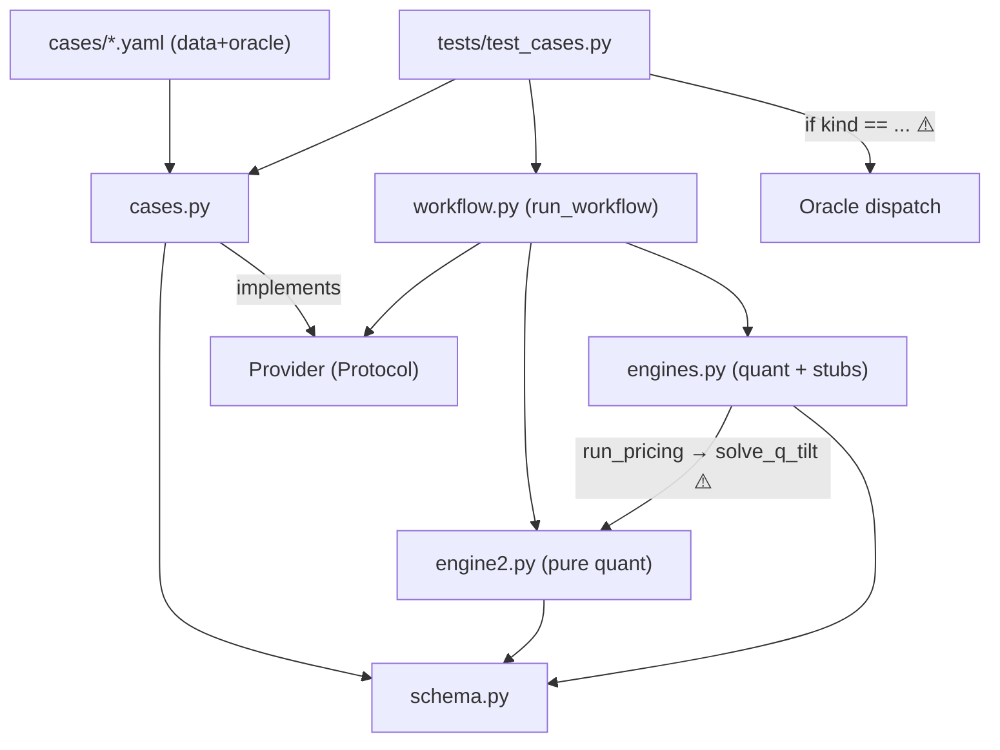

# Architecture Review Report

**Project:** creditmacro / Engine 2 hardening + generic case system (DESIGN-STAGE)
**Date:** 2026-06-06
**Files reviewed:** `docs/engine2_hardening_design.md` (the plan), against existing
`engine/{schema.py, engines.py, example.py, stage0.py}`
**Overall health:** 🟡 Adequate — strong dependency-inversion spine; a handful of
boundary/abstraction fixes should land *before* implementation, not after.

> This is a review of a **proposed** architecture. "Location" cites design-doc
> sections (§N) and the existing code the design builds on. No code was changed.

## Codebase Summary

The system converts a research sentence into a sized, falsifiable trade hypothesis
through four engines over a shared Pydantic `ThemeObject` (`schema.py`), stopping at
a PM decision memo. Today, Engine 2's quant layer (`solve_max_entropy_q`,
`compute_edge`, `run_pricing`) lives in `engines.py` alongside generative stubs, and
the only "runner" is `example.py` — a flat module-level script that hand-builds every
object and calls the quant layer directly. The proposed design (a) extracts a hardened
Engine 2 into a new `engine/engine2.py` (closed-form exponential-tilt q, Monte-Carlo
edge with SNR/attribution, uncertainty-propagating fair value, all behind additive
Optional schema fields), and (b) replaces per-case fixtures with a generic
`CaseSpec` (data) → `ScriptedProvider` (mechanism) → parametrized-runner system that
dispatches on an `oracle.kind`, so cases (AI-issuance, French-banks, future PDFs) are
YAML files rather than classes. The headline architectural intent — *generic
mechanism, specific data, specific assertions* — is sound; the findings below are
about where the proposed boundaries blur it.

## Scorecard

| Dimension | Score | Key Finding |
|---|---|---|
| Boundary Quality | 🟠 | Engine 2 logic split-brained across `engines.py` and new `engine2.py`; `cases.py` bundles schema + I/O + provider |
| Dependency Direction | 🟢 | `Provider` protocol correctly inverts runner→provider; `engine2.py` is pure quant — this is the design's backbone |
| Abstraction Fitness | 🟠 | `Oracle` tagged-optional-fields permit invalid states; fat `Provider` protocol; untyped `list[dict]` attribution at a serialisation boundary |
| DRY & Knowledge | 🟡 | Gate thresholds duplicated (`score_expression` defaults vs new `PolicyConfig`); edge identity formula in two functions |
| Extensibility | 🟡 | New case = 1 YAML file (excellent); new oracle *kind* = 2-file change via a `kind` switch (Open/Closed smell) |
| Testability | 🟡 | Deterministic providers + seeded MC are strong; numeric degeneracies (`Var_q[X]=0`) uncovered |
| Parallelisation | 🟡 | MC draws are embarrassingly parallel but reproducibility needs `SeedSequence`, not a shared seed |

**Overall: 🟡 Adequate — fix AR-BND-001, AR-ABS-001, AR-DRY-001 before writing code; the rest can ride.**

## Dependency Graph (proposed)

⚠️ edges: `engines.py → engine2.py` (the split-brain back-dependency, AR-BND-001);
test → `kind` dispatch (the Open/Closed switch, AR-EXT-001). Graph is acyclic *only
if* `run_pricing` is moved or `solve_max_entropy_q`'s shim lives in `engine2.py`
(see AR-BND-001) — otherwise `engines.py ↔ engine2.py` risks a cycle when `engine2`
imports any helper still in `engines.py`.

## Detailed Findings

### AR-BND-001: Engine 2 logic split-brained across two modules
- **Finding ID:** AR-BND-001
- **Dimension:** Boundary Quality
- **Severity:** 🟠
- **Location:** `engines.py` (`solve_max_entropy_q`, `compute_edge`, `run_pricing`) vs proposed `engine2.py` (`solve_q_tilt`, `compute_edge_mc`); design §5.6
- **Principle violated:** Single Responsibility / cohesion (one concept, two homes)
- **Evidence:** The design adds `engine2.py` for the hardened Engine 2 quant, but leaves `run_pricing`, `compute_edge`, and the `solve_max_entropy_q` name in `engines.py`. `run_pricing` (in `engines.py`) must then call `solve_q_tilt` (in `engine2.py`), creating a back-edge from the older module to the newer one, and the `solve_max_entropy_q` shim duplicates a public name across both files.
- **Impact:** "Where does Engine 2 live?" has two answers. Future edits risk import cycles (`engine2` needing anything still in `engines`), and the shim invites callers to keep using the old name indefinitely. Two modules both named for Engine 2 is exactly the cohesion smell this refactor is meant to remove.
- **Recommendation:** Make `engine2.py` the *single* home for all Engine 2 quant — move `run_pricing` and `compute_edge` into it; have `engines.py` *re-export* them (back-compat) rather than own them. The shim `solve_max_entropy_q` lives in `engine2.py` next to `solve_q_tilt`. Result: dependency points one way (`engines.py → engine2.py`), no cycle risk.

### AR-ABS-001: `Oracle` permits invalid states (tagged optionals instead of a discriminated union)
- **Finding ID:** AR-ABS-001
- **Dimension:** Abstraction Fitness
- **Severity:** 🟠
- **Location:** design §3.3 (`Oracle.kind` + optional `exact`/`acceptance` siblings)
- **Principle violated:** Make illegal states unrepresentable / encapsulation
- **Evidence:** `Oracle` carries `kind` plus optional `exact` and `acceptance` blocks. Nothing structurally prevents `kind="exact"` with `exact=None`, or `kind="exact"` *and* a populated `acceptance` block, or both blocks set. The "required iff" rule is a comment, enforced (at best) by an ad-hoc validator.
- **Impact:** The case-loader and test must defensively re-check consistency; a malformed YAML can construct a "valid" `Oracle` that explodes only at assertion time. This is the data contract for *every* future case — it should be impossible to get wrong.
- **Recommendation:** Model `Oracle` as a **Pydantic discriminated union** on `kind`: `ExactOracle | AcceptanceOracle | InvariantsOnlyOracle`, each carrying exactly its own fields. Give each a polymorphic `check(theme) -> list[AssertionResult]`. This simultaneously fixes AR-EXT-001 (no external `kind` switch needed).

### AR-DRY-001: Gate thresholds will have two sources of truth
- **Finding ID:** AR-DRY-001
- **Dimension:** DRY & Knowledge
- **Severity:** 🟠
- **Location:** `engines.py:score_expression` defaults (`omega_min=2.0, liquidity_min=0.40, cost_fraction_max=0.33, a=0.10, g=0.50`) vs proposed `PolicyConfig` defaults (design §7)
- **Principle violated:** DRY (knowledge duplication — same business rule, two homes)
- **Evidence:** The discipline-gate thresholds are currently hard-coded as keyword defaults in `score_expression`. §7 introduces `PolicyConfig` with the *same* constants as defaults, plus `snr_min`. Now the numbers live in two places.
- **Impact:** Change `liquidity_min` in one place and Test A's "ETF gated out: λ 0.32 < 0.40" invariant can silently diverge from the policy the rest of the system reads. The regression guard depends on these staying identical.
- **Recommendation:** Make `PolicyConfig` the single source. `score_expression` takes a `PolicyConfig` (or its fields) as a parameter with no independent defaults; the `"default"` policy reproduces today's constants exactly. Assert in the AI-issuance test that the default policy yields the golden gate set.

### AR-BND-002: `cases.py` bundles schema, deserialisation I/O, and a provider implementation
- **Finding ID:** AR-BND-002
- **Dimension:** Boundary Quality
- **Severity:** 🟡
- **Location:** design §3.2–§3.5 (`CaseSpec`/`Oracle` models + `load_case` I/O + `ScriptedProvider` behaviour, all in `cases.py`)
- **Principle violated:** Single Responsibility / rate-of-change alignment
- **Evidence:** Three different change-rates share one module: the `CaseSpec`/`Oracle` *models* (slow — change with the domain contract), `load_case` *I/O* (changes with file format / YAML schema), and `ScriptedProvider` *behaviour* (changes with the `Provider` protocol).
- **Impact:** Editing the file format risks touching the provider; the module's "one sentence" needs three "and"s. Modest now, compounds as cases grow.
- **Recommendation:** Split into `cases.py` (models only), `case_loader.py` (`load_case` + prior resolution), `scripted_provider.py` (`ScriptedProvider`). Each becomes independently testable and one-sentence-describable.

### AR-ABS-002: `Provider` protocol is fat (Interface Segregation) and `size_and_risk` bundles three outputs
- **Finding ID:** AR-ABS-002
- **Dimension:** Abstraction Fitness
- **Severity:** 🟡
- **Location:** design §3.1 (9-method `Provider`; `size_and_risk -> tuple[Sizing, Risk, PMGate]`)
- **Principle violated:** Interface Segregation; SRP
- **Evidence:** The protocol has nine seam methods; `ScriptedProvider` implements all nine trivially. A future provider that is generative for *some* seams and scripted for others must still satisfy the whole interface. `size_and_risk` returns a 3-tuple of unrelated outputs (sizing, risk, PM gate).
- **Impact:** All-or-nothing implementation discourages the mixed scripted/LLM providers the design explicitly anticipates. The 3-tuple return is a mild "and" smell mirroring the existing `engine4` stub.
- **Recommendation:** Acceptable for v1 (one implementer), but document the seam protocol as a *composition of narrower protocols* (e.g. `ScenarioSource`, `ExpressionSource`, `RiskSource`) so future providers can mix. Don't over-split now — the Rule of Three applies; just leave the seam boundaries clean. Consider returning a small `SizingRiskBundle` instead of a bare tuple.

### AR-ABS-003: `edge_attribution: Optional[list[dict]]` is untyped at a serialisation boundary
- **Finding ID:** AR-ABS-003
- **Dimension:** Abstraction Fitness
- **Severity:** 🟡
- **Location:** design §7 (`Pricing.edge_attribution: Optional[list[dict]]`)
- **Principle violated:** Pydantic-at-boundaries convention (shared-principles §Python Conventions)
- **Evidence:** `Pricing` is a serialisation boundary (it's dumped to JSON and read by the memo and the LLM contract), yet `edge_attribution` is `list[dict]` — no field validation, no schema, free-form keys.
- **Impact:** The "fixed contract the LLM wires to once" has an unspecified hole; typos in attribution keys surface only downstream.
- **Recommendation:** Introduce a typed `EdgeContribution(BaseModel)` (`scenario: str, contribution: float, disagreement: float`) and type the field `Optional[list[EdgeContribution]]`.

### AR-EXT-001: Adding an oracle kind requires editing a `kind` dispatch switch (Open/Closed)
- **Finding ID:** AR-EXT-001
- **Dimension:** Extensibility
- **Severity:** 🟡
- **Location:** design §10 ("dispatch on `oracle.kind`") + §3.3
- **Principle violated:** Open/Closed
- **Evidence:** The runner/test branches on `oracle.kind` (`exact` / `acceptance` / `invariants_only`). A new kind (say `quantile_band`) means modifying that switch *and* the `Oracle` model.
- **Impact:** Two-file change per oracle kind; the kind set is exactly the dimension most likely to grow as new validation styles appear.
- **Recommendation:** Fold into AR-ABS-001 — make oracles polymorphic (`oracle.check(theme)`), so the runner calls one method and new kinds are add-only (1 new class, 0 edits to the runner). Note the *invariants floor* stays a separate always-run step, correctly.

### AR-TST-001: Numeric degeneracies of the tilt solver are uncovered
- **Finding ID:** AR-TST-001
- **Dimension:** Testability
- **Severity:** 🟡
- **Location:** design §5 (`solve_q_tilt`) + §6 (MC); §11 unit-test plan
- **Principle violated:** Edge-case coverage for numerical code (shared-principles §Testing)
- **Evidence:** The Newton step in §5.1 uses `dE_q[X]/dλ = Var_q[X]`. When all `X_s` are equal (or an MC draw collapses them), `Var_q[X]=0` → division by zero; the feasibility test (`X_mkt` interior) also degenerates when `min X_s == max X_s`. The plan tests feasibility boundaries but not the zero-variance / all-equal / single-scenario degeneracies, nor what a `q_status=INFEASIBLE` propagation does to `compute_edge_mc`'s `infeasible_fraction`.
- **Impact:** A silently-NaN q or a div-by-zero surfaces as a crash mid-MC rather than a clean status.
- **Recommendation:** Add explicit unit tests (and `hypothesis` property tests) for: all-`X_s`-equal, single scenario, `X_mkt` on the boundary, and an MC run where a non-trivial fraction of draws are infeasible — asserting `infeasible_fraction` is reported, not swallowed.

### AR-PAR-001: MC is embarrassingly parallel but reproducibility needs `SeedSequence`
- **Finding ID:** AR-PAR-001
- **Dimension:** Parallelisation
- **Severity:** 🟡
- **Location:** design §6 (Monte-Carlo edge, "fixed RNG seed")
- **Principle violated:** None (missed opportunity + a correctness trap if done naively)
- **Evidence:** Each MC draw (sample `X`, sample `p`, re-solve q, recompute edge) is independent — ideal for `concurrent.futures`/`ProcessPoolExecutor`. But the design says "fixed RNG seed"; a single shared seed across workers either serialises the draws or produces correlated/duplicate streams.
- **Impact:** Naive parallelisation breaks the determinism the regression guard relies on.
- **Recommendation:** Specify `numpy.random.SeedSequence(seed).spawn(n_draws)` (or per-chunk child seeds) so each draw has an independent, reproducible stream regardless of execution order. Keep the sequential path as the reference; parallel must produce bit-identical results.

## Positive Highlights

1. **The dependency-inversion spine is correct and is the whole point.** Routing the runner through a `Provider` protocol, with `ScriptedProvider` as an input-blind implementation, means `run_workflow` never learns which case it holds — and the same seam later accepts an LLM provider with zero runner changes. This is textbook DIP and it's the design's strongest asset. Preserve it.
2. **`engine2.py` as a pure, side-effect-free quant module** (no I/O, fixed seed, typed in/out) is exactly right for numerical code — it makes every routine unit-testable in isolation and the golden-number reproduction provable.
3. **Additive-Optional schema evolution** (§7) is a disciplined regression strategy: σ=0 / high-κ defaults make every new code path inert for existing data, so Test A stays byte-identical *by construction*, not by luck.
4. **The oracle taxonomy with an always-on invariants floor** is a genuinely good idea — it lets unverifiable PDF cases enter as `invariants_only` (must not crash, must be directionally sane) without inventing fake numbers, while exact/acceptance cases get sharp assertions.

## Recommended Review Cadence

Re-run this review **after Step 1 lands** (case system + AI-issuance retrofit) to
confirm the split-brain (AR-BND-001) and policy-source (AR-DRY-001) decisions were
resolved as recommended *before* the engine2 math is built on top of them — and
again **before adding the third case type** (the first PDF / `invariants_only`
case), which is when the oracle-polymorphism decision (AR-ABS-001/AR-EXT-001) pays
off or hurts.

---

## Handoff

### Scorecard

| Dimension | Score | Key Finding |
|---|---|---|
| Boundaries | 🟠 | Engine 2 split across `engines.py` + new `engine2.py`; `cases.py` bundles 3 concerns |
| Dependencies | 🟢 | `Provider` protocol inverts runner→provider correctly; `engine2.py` pure |
| Abstraction | 🟠 | `Oracle` allows invalid states; fat `Provider`; untyped `list[dict]` attribution |
| DRY | 🟡 | Gate thresholds duplicated across `score_expression` and `PolicyConfig` |
| Extensibility | 🟡 | New case = 1 file (great); new oracle kind = `kind`-switch edit |
| Testability | 🟡 | Strong determinism; solver degeneracies (`Var_q=0`) uncovered |
| Parallelisation | 🟡 | MC parallelisable; needs `SeedSequence` for reproducibility |

### Findings

- **AR-BND-001** · 🟠 · Boundaries · `engines.py` vs `engine2.py` (§5.6) — Engine 2 logic split across two modules; `run_pricing` back-depends on `engine2`. Make `engine2.py` the single home; `engines.py` re-exports.
- **AR-ABS-001** · 🟠 · Abstraction · `Oracle` (§3.3) — tagged optional `exact`/`acceptance` fields allow invalid states. Use a Pydantic discriminated union with a polymorphic `check()`.
- **AR-DRY-001** · 🟠 · DRY · `score_expression` defaults vs `PolicyConfig` (§7) — gate thresholds duplicated. Make `PolicyConfig` the single source; pass it into `score_expression`.
- **AR-BND-002** · 🟡 · Boundaries · `cases.py` (§3.2–3.5) — models + I/O + provider bundled. Split into `cases.py` / `case_loader.py` / `scripted_provider.py`.
- **AR-ABS-002** · 🟡 · Abstraction · `Provider` (§3.1) — 9-method fat protocol; `size_and_risk` returns a 3-tuple. Document as composable narrower protocols; consider a typed bundle return.
- **AR-ABS-003** · 🟡 · Abstraction · `Pricing.edge_attribution` (§7) — `list[dict]` at a serialisation boundary. Introduce typed `EdgeContribution`.
- **AR-EXT-001** · 🟡 · Extensibility · runner oracle dispatch (§10) — `kind` switch violates Open/Closed. Resolve via AR-ABS-001 polymorphism.
- **AR-TST-001** · 🟡 · Testability · `solve_q_tilt` (§5/§6) — `Var_q[X]=0` / all-equal-`X_s` / single-scenario / infeasible-fraction paths uncovered. Add edge-case + `hypothesis` tests.
- **AR-PAR-001** · 🟡 · Parallelisation · MC (§6) — parallelisable but needs `numpy.random.SeedSequence.spawn` for reproducible, order-independent draws.
