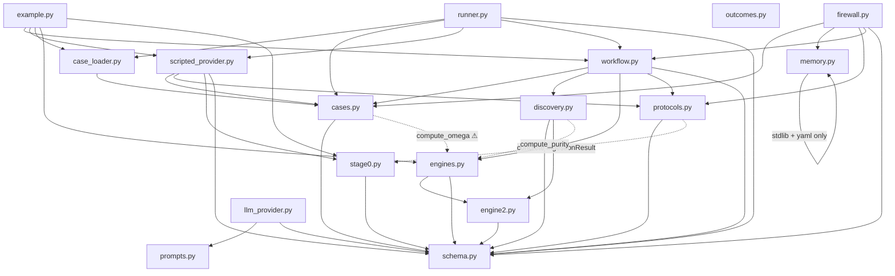

# Architecture Review Report

**Project:** Theme-to-Trade Conversion Engine (`engine/`)
**Date:** 2026-06-06
**Files reviewed:** 18 engine modules (4,059 LOC) + wiki layer + CLAUDE.md
**Overall health:** 🟡 Adequate — strong seams and discipline, but the schema god-module and a duplicated causal invariant need attention before the model grows further

> Scope note: this is the **post-firewall** review (discovery firewall, decomposed confidence,
> memory access firewall). It supersedes `2026_06_06_architecture_review.md` (case-system era).
> Finding IDs restart at 001 in this version.

## Codebase Summary

`engine/` is an epistemic credit-macro pipeline that converts a research document into a
falsifiable thematic hypothesis and STOPS at a PM memo. A frozen, status-carrying
`ThemeObject` (schema.py) is populated by a `Provider`-protocol seam (protocols.py) and an
orchestrator (workflow.py) that runs in two modes: `discovery` (default — builds a causal
object and routes ranked strategy families via discovery.py, then stops at
`strategy_family_routed`) and `expression` (the full Engine-2 pricing / Engine-3 scoring /
Engine-4 sizing pipeline). The numeric core is real and golden-mastered — engine2.py
(max-entropy `q` tilt, edge identity) and engines.py (`compute_omega/purity/score`) — while
the generative seams (engines.py `engine1..4`, stage0.py `parse_research_text`) are
`NotImplementedError` stubs fed instead by `ScriptedProvider` from YAML cases. Two firewalls
sit on top: the discovery gates (schema validators) refuse to emit a trade without a causal
object, and the memory access firewall (memory.py + firewall.py) keeps `case` wiki pages out
of fresh phase-A reasoning via a fail-closed retriever and an immutable frozen snapshot.
Entry points: `python -m engine.example` (worked memo), `runner.run_case` (oracle harness),
`firewall.run_two_phase` (firewalled pass). The import graph is an acyclic, layered DAG
rooted at schema.py.

## Scorecard

| Dimension | Score | Key Finding |
|---|---|---|
| Boundary Quality | 🟠 | `schema.py` (726 LOC) is one file holding the entire domain model; `engines.py` bundles scoring + generative stubs + a re-export facade |
| Dependency Direction | 🟢 | Acyclic, cleanly layered, `Provider` protocol seam, infra (anthropic) lazily injected — minor model→quant edges only |
| Abstraction Fitness | 🟡 | `LLMProvider` advertises a Provider but implements 1 of ~13 seams; `Pricing` mutable while `ThemeObject` frozen |
| DRY & Knowledge | 🟡 | "promoted/main_theme must carry an operational axis" invariant restated in ~4 places |
| Extensibility | 🟡 | New strategy family touches ~2 files across 4 dicts; the `engineN` stubs are orphaned (workflow never calls them) |
| Testability | 🟡 | `example.py` runs the whole pipeline at **import time**; the golden master depends on that side effect |
| Parallelisation | 🟡 | `compute_edge_mc` runs 10k independent MC draws sequentially |

**Overall: 🟡 Adequate — functional, well-sealed at the seams, but structural investment in the schema boundary is the highest-leverage next step.**

## Dependency Graph

No cycles. `schema.py` is the universal sink (fan-in ≈ 12) — expected for a model root.
`memory.py` is fully standalone (no intra-engine imports). The two ⚠ edges are direction
smells, not violations (see AR-DEP-002).

## Detailed Findings

### AR-BND-001: `schema.py` is a 726-line god-module holding the entire domain model
- **Finding ID:** AR-BND-001
- **Dimension:** Boundaries
- **Severity:** 🟠
- **Location:** `engine/schema.py` (entire file)
- **Principle violated:** Single Responsibility / Rate-of-change alignment
- **Evidence:** One file defines ~30 models spanning unrelated subdomains: Stage-0 streams
  (`Observation`, `CandidateTheme`, `ConsensusSignal`), Iceberg (`IcebergScores`,
  `IcebergClassification`), causal compiler (`CausalNode/Edge/Chain` + `_chain_is_connected`),
  Meadows system map (`Stock/Flow/FeedbackLoop/Delay/SystemMap`), trap detector
  (`LoopDiagnosis/TrapImplications/BiasCritique`), Engine-2/3/4 outputs (`Scenario/Pricing/
  Expression/Sizing/Risk`), discovery (`StrategyFamilyRec/ConfidenceComponents`), and
  `ThemeObject` with both expression and discovery gate validators.
- **Impact:** Every schema change anywhere in the system touches this file; it is the
  fastest-changing file in the repo (heavily edited across the last four feature passes).
  Merge-conflict magnet, and a reader cannot tell from the layout which models belong to
  discovery vs expression vs stage-0. Rate of change: **fast**, bundled with **structural**
  (validators) and **slow** (Provenance) concepts.
- **Recommendation:** Split into a `schema/` package by subdomain (`streams.py`, `iceberg.py`,
  `causal.py`, `system_map.py`, `trap.py`, `pricing.py`, `expression.py`, `strategy_family.py`,
  `theme.py`), re-exporting from `schema/__init__.py` so existing `from .schema import X` keeps
  working. Direction only — defer the cut to refactoring-plan.

### AR-DRY-001: The "promoted theme must carry an operational axis" invariant is restated in ~4 places
- **Finding ID:** AR-DRY-001
- **Dimension:** DRY
- **Severity:** 🟠
- **Location:** `schema.py:190` (`CausalNode._axis_rules`, promoted variant), `schema.py:699`
  (`ThemeObject._discovery_gates` D-Gate 2), `workflow.py:264` (`_validate_causal_chain`),
  `llm_provider.py:97-103` (`expand_causal` post-parse check)
- **Principle violated:** DRY (knowledge duplication of a domain invariant)
- **Evidence:** Each site expresses "a routed/promoted `kind=='theme'` node must have
  `axis is not None and axis_operational`" with slightly different wording and predicate
  ordering. The CausalNode validator gates `promoted`; `_validate_causal_chain` and
  `llm_provider` gate `main_theme`; the discovery gate re-checks `main_theme`.
- **Impact:** The rule is genuine knowledge, not coincidental structure — if it evolves
  (e.g. "promoted theme needs an axis AND a falsifier"), four call sites must change in
  lockstep or diverge silently. This already drifted once: relaxing the per-node rule this
  session required a follow-up fix in `llm_provider` because the invariant lived in multiple
  spots.
- **Recommendation:** Centralise as one predicate (e.g. `CausalNode.is_routable()` or a
  module-level `assert_routable(node)`), and have all four sites call it. Direction only.

### AR-BND-002: `engines.py` bundles three unrelated responsibilities
- **Finding ID:** AR-BND-002
- **Dimension:** Boundaries
- **Severity:** 🟡
- **Location:** `engine/engines.py` (`compute_omega/purity/score_expression` vs
  `engine1_driver_extractor..engine4_sizer_and_risk` vs the `from .engine2 import ...` re-export at lines 30-34)
- **Principle violated:** Single Responsibility
- **Evidence:** The module simultaneously (a) implements real expression-scoring math, (b)
  holds five generative LLM-seam stubs that raise `NotImplementedError`, and (c) re-exports
  `compute_edge/run_pricing/solve_max_entropy_q` from engine2 purely for back-compat.
- **Impact:** "What does engines.py do?" has no one-sentence answer. The facade means a reader
  must know that `run_pricing` *actually* lives in engine2; the stubs invite confusion about
  what's wired (see AR-EXT-001).
- **Recommendation:** Separate the pure scoring math (`scoring.py`) from the generative seam
  stubs (`generative.py`), and let callers import pricing from `engine2` directly (drop the
  re-export once call sites are migrated). Direction only.

### AR-EXT-001: The `engineN` generative stubs are orphaned — the workflow never calls them
- **Finding ID:** AR-EXT-001
- **Dimension:** Extensibility
- **Severity:** 🟡
- **Location:** `engine/engines.py:166-301` (`engine1_driver_extractor`, `engine1_axis_definer`,
  `engine2_scenario_proposer`, `engine3_expression_enumerator`, `engine4_sizer_and_risk`)
- **Principle violated:** Dead/vestigial abstraction; single source of the seam contract
- **Evidence:** `workflow.py` obtains all generative outputs through the `Provider` protocol
  (`provider.extract_drivers`, `provider.define_axis`, `provider.propose_scenarios`, …), never
  through these module-level functions. They are imported by `cases.py`/`example.py` only for
  their *types*, not called. They duplicate, in prose, the contract the `Provider` protocol
  already owns.
- **Impact:** Two competing definitions of "how a generative engine is invoked" (free functions
  vs protocol methods). A contributor wiring a real LLM seam must guess which is canonical
  (it's the protocol). The stubs read as a roadmap but are structurally inert.
- **Recommendation:** Either delete them and keep the `Provider` protocol as the single seam
  contract, or demote them to docstrings/TODOs on the protocol. Direction only.

### AR-ABS-001: `LLMProvider` advertises a `Provider` but implements only one of ~13 seams
- **Finding ID:** AR-ABS-001
- **Dimension:** Abstraction
- **Severity:** 🟡
- **Location:** `engine/llm_provider.py` (only `expand_causal` is implemented); `engine/protocols.py:82-129` (full `Provider`)
- **Principle violated:** Interface Segregation / honest typing
- **Evidence:** `Provider` (a `@runtime_checkable` Protocol) declares `context`, `parse`,
  `extract_drivers`, `define_axis`, `propose_scenarios`, `enumerate_expressions`,
  `size_and_risk`, `build_system_map`, `diagnose_loops`, `assess_trap_implications`, etc.
  `LLMProvider` implements `expand_causal` alone, so `isinstance(LLMProvider(), Provider)` is
  False and `run_workflow(LLMProvider(), …)` would `AttributeError`.
- **Impact:** The name implies a drop-in provider; in reality it's a single-seam adapter that
  cannot drive the workflow. The fat `Provider` protocol forces all-or-nothing implementation.
- **Recommendation:** Reflect reality in the types — name the narrow seam it satisfies (e.g. a
  `CausalExpander` protocol, which the segmented protocol design already anticipates) rather
  than the full `Provider`. Direction only.

### AR-TST-001: `example.py` executes the full pipeline at import time; the golden master depends on the side effect
- **Finding ID:** AR-TST-001
- **Dimension:** Testability
- **Severity:** 🟡
- **Location:** `engine/example.py:106-109` (module-level `_case = load_case(...)`,
  `theme, _memo = run_workflow(...)`); `tests/integration/test_golden_master.py` (`from engine.example import theme, pricing, …`)
- **Principle violated:** Separation of definition from execution; import purity
- **Evidence:** Importing `engine.example` runs `run_workflow` and builds `THEME_JSON`/`MEMO`
  at module load. The golden-master test imports those module globals to assert on them.
- **Impact:** Import is no longer free — any importer pays a full pipeline run; a failure in
  the pipeline surfaces as an *import error* in unrelated tests. The golden master is coupled
  to module-load ordering rather than calling a function.
- **Recommendation:** Wrap the worked example in a `build_example() -> (ThemeObject, str)`
  function and have both `main()` and the test call it. Direction only.

### AR-DEP-002: Model/oracle layer reaches into the quant layer; the seam protocol imports a concrete ingestion type
- **Finding ID:** AR-DEP-002
- **Dimension:** Dependencies
- **Severity:** 🟡
- **Location:** `cases.py:23` (`from .engines import compute_omega`), `protocols.py:35`
  (`from .stage0 import IngestionResult`), `discovery.py:27-28` (imports from both `engine2` and `engines`)
- **Principle violated:** Dependency Inversion (mild) / layer leakage
- **Evidence:** `cases.py` is the CaseSpec/Oracle *data* layer yet imports a quant function to
  recompute Ω inside `AcceptanceOracle.check`. `protocols.py` defines the abstraction seam but
  depends on `stage0.IngestionResult`, a concrete dataclass, coupling the seam to one ingestion
  shape. `discovery.py` pulls from two different quant modules because of the engines/engine2
  split (AR-BND-002).
- **Impact:** Minor today (DAG is intact), but the oracle's quant dependency means a scoring
  change can ripple into the case-definition layer, and the protocol can't be reused without
  stage0.
- **Recommendation:** Have oracles assert on values already on the `ThemeObject` (the workflow
  already computes Ω) rather than recomputing; type the `parse` seam against a protocol/return
  type owned by protocols.py, not stage0. Direction only.

### AR-ABS-002: Inconsistent immutability — `ThemeObject` is frozen but its nested `Pricing` is mutable
- **Finding ID:** AR-ABS-002
- **Dimension:** Abstraction
- **Severity:** 🟡
- **Location:** `schema.py` (`ThemeObject`, `StrategyFamilyRec`, `ConfidenceComponents` are
  `frozen=True`; `Pricing` is not), `engine2.py:398-413` (`run_pricing` mutates
  `pricing.edge_attribution = …`, `pricing.snr = …` after construction)
- **Principle violated:** Encapsulation / invariant consistency
- **Evidence:** The memory firewall relies on the frozen `ThemeObject` snapshot, but
  `theme.pricing.snr = 0.0` would still succeed (Pricing built incrementally and left mutable),
  and frozen models still expose mutable `list` fields (`theme.strategy_families.append(...)`
  is not blocked).
- **Impact:** The immutability guarantee the firewall advertises is attribute-deep on
  `ThemeObject` only; a determined mutation of a nested pricing field or list escapes it. Low
  exploitability (nothing does this today) but it weakens the "frozen by construction" claim.
- **Recommendation:** Decide the immutability boundary explicitly — either freeze the nested
  output models too (and build `Pricing` via a builder that returns a final frozen instance) or
  document that the hash, not Python immutability, is the integrity anchor. Direction only.

### AR-PAR-001: `compute_edge_mc` runs independent Monte-Carlo draws sequentially
- **Finding ID:** AR-PAR-001
- **Dimension:** Parallelisation
- **Severity:** 🟡 (opportunity, not a defect)
- **Location:** `engine2.py:303-311` (`for child in np.random.SeedSequence(seed).spawn(n_draws): …`)
- **Principle violated:** none — missed opportunity
- **Evidence:** Each of `n_draws` (default 10,000) draws is independent (own RNG stream via
  `SeedSequence.spawn`), re-solving the tilt per draw — embarrassingly parallel and CPU-bound.
- **Impact:** Edge-MC is the slowest path when enabled; today it's off by default so impact is
  latent. Worth noting before MC becomes a default or `n_draws` grows.
- **Recommendation:** Keep the seed-per-draw design (already parallel-safe) and offer a
  `ProcessPoolExecutor` map when `n_draws` is large. Direction only.

## Positive Highlights

1. **The `Provider` protocol seam is genuinely well-designed.** It is segmented
   (`ScenarioSource`/`ExpressionSource`/`RiskSource`) then composed into `Provider`
   (protocols.py), so the runner is input-blind and a scripted case is indistinguishable from
   a generative one. This is textbook Dependency Inversion and is the backbone of the test
   strategy. **Preserve it.**
2. **Illegal states are largely unrepresentable.** The `Oracle` discriminated union with a
   polymorphic `check()` (cases.py), the status-routed discipline gates, and the frozen
   `ThemeObject` mean the type system — not runtime checks scattered in callers — enforces the
   discovery/expression firewall.
3. **The memory access firewall is enforced by construction.** A fail-closed `MemoryRetriever`
   plus a hashed frozen snapshot (memory.py + firewall.py) makes "reason fresh, then consult
   history" auditable rather than honor-system — and it is fully standalone (zero intra-engine
   coupling).
4. **Regression discipline is excellent.** A 1e-6 golden master pins the quant outputs and has
   survived four feature passes unchanged; 178 tests run in ~6s with no network/DB. The wiki
   strategy-family taxonomy is *generated from* the engine's own Literal + `_DOWNSTREAM`,
   keeping memory and code in lockstep.

## Recommended Review Cadence

Re-run this review **before the next schema-shaped feature lands** (e.g. real generative seams,
a portfolio layer, or persistence of outcomes) — that is the moment AR-BND-001 (the schema
god-module) will compound. Also re-run **after the first real `LLMProvider` seam is wired**, to
confirm AR-ABS-001/AR-EXT-001 were resolved rather than worked around. No calendar trigger
needed; the structural triggers are schema growth and provider realisation.

## Handoff

### Scorecard

| Dimension | Score | Key Finding |
|---|---|---|
| Boundaries | 🟠 | `schema.py` (726 LOC) holds the entire domain model; `engines.py` bundles scoring + stubs + re-export facade |
| Dependencies | 🟢 | Acyclic layered DAG with a `Provider` protocol seam and lazily-injected infra; only minor model→quant edges |
| Abstraction | 🟡 | `LLMProvider` implements 1 of ~13 `Provider` seams; immutability inconsistent (`Pricing` mutable under frozen `ThemeObject`) |
| DRY | 🟡 | "promoted theme needs an operational axis" invariant restated in ~4 sites |
| Extensibility | 🟡 | New family touches ~2 files / 4 dicts; `engineN` generative stubs are orphaned |
| Testability | 🟡 | `example.py` runs the full pipeline at import time; golden master depends on it |
| Parallelisation | 🟡 | `compute_edge_mc` 10k independent draws run sequentially |

### Findings

- **AR-BND-001** · 🟠 · Boundaries · `engine/schema.py` (whole file) · One 726-LOC module holds ~30 models across stage-0/iceberg/causal/system-map/trap/pricing/expression/strategy-family/theme; fastest-changing file, no subdomain boundaries.
- **AR-DRY-001** · 🟠 · DRY · `schema.py:190`, `schema.py:699`, `workflow.py:264`, `llm_provider.py:97` · The "promoted/main_theme must carry an operational axis" invariant is expressed in ~4 places and already drifted once.
- **AR-BND-002** · 🟡 · Boundaries · `engine/engines.py:30-34,166-301` · Bundles pure scoring math, five generative `NotImplementedError` stubs, and a back-compat re-export of engine2.
- **AR-EXT-001** · 🟡 · Extensibility · `engine/engines.py:166-301` · `engine1..4` free-function stubs are never called by the workflow (it uses the `Provider` protocol), duplicating the seam contract.
- **AR-ABS-001** · 🟡 · Abstraction · `engine/llm_provider.py`, `engine/protocols.py:82` · `LLMProvider` implements only `expand_causal`, so it is not a usable `Provider` despite the name; the fat protocol forces all-or-nothing.
- **AR-TST-001** · 🟡 · Testability · `engine/example.py:106-109`, `tests/integration/test_golden_master.py` · The worked example runs `run_workflow` at import time; the golden master imports its module globals.
- **AR-DEP-002** · 🟡 · Dependencies · `cases.py:23`, `protocols.py:35`, `discovery.py:27-28` · Oracle/data layer recomputes Ω via `engines`; the `Provider` protocol imports concrete `stage0.IngestionResult`.
- **AR-ABS-002** · 🟡 · Abstraction · `schema.py` (`Pricing` unfrozen), `engine2.py:398-413` · `ThemeObject` is frozen but nested `Pricing` is mutated post-construction and list fields remain mutable, weakening the firewall's immutability claim.
- **AR-PAR-001** · 🟡 · Parallelisation · `engine2.py:303-311` · 10k independent Monte-Carlo edge draws run in a sequential loop (opportunity, latent until MC is default).
