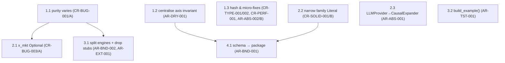
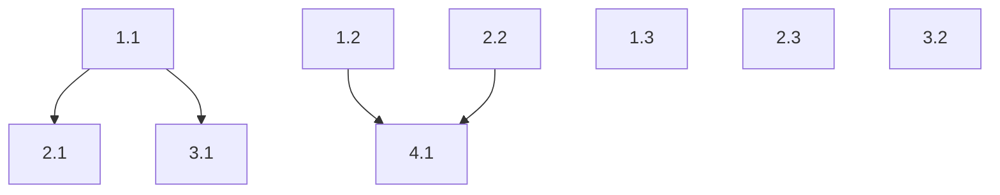

# Refactoring Roadmap

**Project:** Theme-to-Trade Conversion Engine (`engine/`)
**Date:** 2026-06-07
**Findings consolidated:** 15 (9 AR + 8 CR, with CR-DRY-001 ≡ AR-DRY-001 merged)
**Fork decisions:** CR-BUG-001 → **A** (make purity vary) · CR-BUG-003 → **A** (x_mkt Optional) · CR-SOLID-001 → **B** (narrow Literal) · AR-ABS-002 → **B** (document hash-as-anchor)

## Executive Summary

The engine is structurally sound (clean DAG, protocol seam, golden master intact); this plan
fixes the one real correctness bug (`purity` is a dead factor), aligns documented behaviour
with reachable states, and tidies module boundaries — ending with the schema god-module split.
The path is four phases, each leaving all 178 tests green; **no step touches the golden-master
numbers**. Load-bearing fixes are **CR-BUG-001** (correctness) and **AR-DRY-001** (stops a
known-drifting invariant); **AR-BND-001** is the high-leverage structural finish.

## Consolidated Findings

| Finding ID | Finding | Source | Severity | Dimension | Fork |
|---|---|---|---|---|---|
| CR-BUG-001 | `purity` factor tautologically 1.0 | code-review | 🟠 | Correctness | **A** |
| AR-DRY-001 / CR-DRY-001 | Routable-theme axis invariant in ~4 sites | both | 🟠 | DRY | — |
| AR-BND-001 | `schema.py` god-module (726 LOC) | review-arch | 🟠 | Boundaries | — |
| AR-BND-002 | `engines.py` bundles scoring + stubs + facade | review-arch | 🟡 | Boundaries | — |
| AR-EXT-001 | `engineN` generative stubs orphaned | review-arch | 🟡 | Extensibility | — |
| AR-ABS-001 | `LLMProvider` ≠ real `Provider` | review-arch | 🟡 | Abstraction | — |
| AR-TST-001 | `example.py` runs pipeline at import | review-arch | 🟡 | Testability | — |
| AR-ABS-002 | `Pricing` mutable under frozen `ThemeObject` | review-arch | 🟡 | Abstraction | **B** |
| CR-BUG-003 | "no market value" cap unreachable | code-review | 🟡 | Correctness | **A** |
| CR-SOLID-001 | 5 of 14 families unroutable | code-review | 🟡 | SOLID | **B** |
| CR-TYPE-001 | `Optional` unimported in `case_loader` | code-review | 🟡 | Types | — |
| CR-TYPE-002 | Hash includes volatile `id`/`created_at` | code-review | 🔵 | Correctness | — |
| CR-PERF-001 | `compute_omega` no empty guard | code-review | 🔵 | Correctness | — |
| AR-DEP-002 | Oracle recompute / protocol→stage0 | review-arch | 🟡 | Dependencies | *deferred* |
| CR-BUG-002 | stage0 ranks count − mean | code-review | 🟡 | Correctness | *deferred* |
| AR-PAR-001 | MC loop sequential | review-arch | 🟡 | Parallelisation | *deferred* |

## Baseline Scorecard (from review)

| Dimension | Score |
|---|---|
| Boundaries | 🟠 |
| Dependencies | 🟢 |
| Abstraction | 🟡 |
| DRY | 🟡 |
| Extensibility | 🟡 |
| Testability | 🟡 |
| Parallelisation | 🟡 |

## Dependency Graph

## Parallel Tracks

| Track | Steps | Theme | Can start immediately? |
|---|---|---|---|
| A | 1.1 → 2.1 | Discovery-confidence correctness | Yes |
| B | 1.2 → 2.2 → 4.1 | DRY → schema package | Yes |
| C | 2.3, 3.1, 3.2 | Boundary & seam honesty | Yes |
| D | 1.3 | Hygiene & hash integrity | Yes |

---

## Phase 1: Correctness & Hygiene — Quick Wins
**Target:** the confidence model has no dead factor; the routable-theme invariant lives in one
place; trivial type/robustness nits gone; the firewall hash is the documented integrity anchor.
**Effort:** small.

### Step 1.1: Make `purity` a real, varying confidence factor (fork A)
**Finding IDs:** CR-BUG-001
**Priority score:** Impact 4 ×2 − Scope 1 − Risk 2 = **5**
**Scope:** single-module
**Risk level:** low

**What changes:**
- In `discovery.py`, stop setting `family_pnl = [m for m in axis_moves]` (an exact copy that
  forces `compute_purity → 1.0`). Feed `compute_purity` a family-monetisation series that
  reflects the family's *imperfect* tracking of the axis — i.e. include a residual/basis term
  so `purity ∈ [0,1)` where the family doesn't perfectly isolate the axis.
- Source the per-family tracking fidelity from a small table (analogous to `_AXIS_FIT`) or
  derive it from the family's leg structure; replace the `purity = 1.0` no-scenario placeholder
  with the same model gated on data availability.

**What doesn't change:**
- `ConfidenceComponents` shape (still six components, `edge_survival` union).
- The `confidence = causal × axis_fit × edge × purity × data` product identity.
- Routing decisions; the golden-master numbers.

**Verification:**
- [ ] All existing tests pass.
- [ ] A family that imperfectly tracks its axis yields `confidence_components.purity < 1.0`.
- [ ] The product identity still holds (`confidence == causal × axis_fit × edge × purity × data`).
- [ ] `steepener` remains the top routed family on the curve case.
- [ ] [SUGGEST: add a test pinning purity < 1.0 for a low-fidelity family]

**Depends on:** none
**Blocks:** 2.1, 3.1
**Rollback:** restore `family_pnl = list(axis_moves)`; purity returns to 1.0.

### Step 1.2: Centralise the routable-theme axis invariant
**Finding IDs:** AR-DRY-001, CR-DRY-001
**Priority score:** Impact 3 ×2 − Scope 2 − Risk 1 = **3**
**Scope:** multi-module
**Risk level:** low

**What changes:**
- Add ONE predicate (e.g. `CausalNode.is_routable()` or module fn `assert_routable_theme(node)`)
  in `schema.py` encoding "a promoted/routed `kind=='theme'` node has `axis is not None and
  axis_operational`".
- Replace the four hand-written checks with calls to it: `schema.py:190` (CausalNode validator),
  `schema.py:699` (discovery D-Gate 2), `workflow.py:264` (`_validate_causal_chain`),
  `llm_provider.py:97` (`expand_causal`).

**What doesn't change:**
- The invariant's semantics or where it is enforced; all gate behaviour.

**Verification:**
- [ ] All existing tests pass (causal schema, workflow, expand_causal).
- [ ] `grep` shows exactly one definition of the predicate; four call sites reference it.

**Depends on:** none
**Blocks:** 4.1
**Rollback:** re-inline the four checks.

### Step 1.3: Hash integrity + micro-fixes (fork B for AR-ABS-002)
**Finding IDs:** CR-TYPE-001, CR-PERF-001, CR-TYPE-002, AR-ABS-002
**Priority score:** Impact 2 ×2 − Scope 2 − Risk 1 = **1**
**Scope:** multi-module
**Risk level:** low

**What changes:**
- `case_loader.py`: add `Optional` to the `typing` import (CR-TYPE-001).
- `engines.py` `compute_omega`: guard empty `pnl_series` with an explicit error (CR-PERF-001).
- `firewall.py` `_hash_theme`: hash a canonical subset (causal object + routed families)
  excluding volatile `id`/`created_at`, so identical fresh reasonings hash equal across runs
  (CR-TYPE-002).
- `schema.py` / `firewall.py` docstrings: state that the **content hash**, not nested-model
  immutability, is the integrity anchor — `Pricing` stays mutable by design (AR-ABS-002, fork B).

**What doesn't change:**
- `compute_omega` results for non-empty input; pricing build flow; firewall pass/fail logic.

**Verification:**
- [ ] All existing tests pass (incl. the two-phase firewall tests).
- [ ] `typing.get_type_hints(resolve_prior)` no longer raises.
- [ ] `compute_omega([])` raises a clear error rather than producing NaN.
- [ ] Two independent runs of identical fresh reasoning produce equal `content_hash`.

**Depends on:** none
**Blocks:** none
**Rollback:** per-file revert; restore full-JSON hash.

---

## Phase 2: Reachability & Seam Honesty
**Target:** documented behaviour matches reachable states (no-market-value path live; family
taxonomy = what actually routes); the causal-expander seam is typed honestly.
**Effort:** small–medium.

### Step 2.1: Make "no current market value" representable (fork A)
**Finding IDs:** CR-BUG-003
**Priority score:** Impact 3 ×2 − Scope 3 − Risk 2 = **1**
**Scope:** multi-module
**Risk level:** medium

**What changes:**
- `protocols.py`: `RunContext.x_mkt: Optional[float]` (and `CaseSpec.x_mkt` optional for
  discovery-only cases).
- `workflow.py`: discovery passes `has_market_value = ctx.x_mkt is not None` (now genuinely
  variable); **expression** mode raises a clear error if `x_mkt is None` (pricing requires it).
- `discovery.py`: the `edge_survival="unknown"` / 0.60-ceiling path becomes reachable through
  `run_workflow`.

**What doesn't change:**
- Expression pricing when `x_mkt` is present; golden master (ai_issuance supplies `x_mkt`).

**Verification:**
- [ ] All existing tests pass.
- [ ] A discovery case with `x_mkt=None` routes with `edge_survival="unknown"`, `confidence ≤ 0.60`,
      and `why_not` naming the missing market value — via `run_workflow` (not just a direct call).
- [ ] Expression mode with `x_mkt=None` raises a clear error.
- [ ] [SUGGEST: add a no-mark discovery fixture]

**Depends on:** 1.1
**Blocks:** none
**Rollback:** revert `RunContext.x_mkt` to required `float`.

### Step 2.2: Narrow the family Literal to what routes (fork B)
**Finding IDs:** CR-SOLID-001
**Priority score:** Impact 2 ×2 − Scope 3 − Risk 2 = **−1**
**Scope:** multi-module
**Risk level:** medium

**What changes:**
- `schema.py`: remove the five never-routed families (`curve`, `sector_rotation`,
  `capital_structure`, `etf_basket_rv`, `index_index_rv`) from `StrategyFamilyRec.family`,
  leaving the 9 routable + `watchlist_only`. Add a comment: re-add each when its routing rule
  lands (the long-term A path).
- Delete the five corresponding `wiki/strategy-families/*.md` pages and their `index.md` entries.

**What doesn't change:**
- Routing logic; the 9 routable families; confidence; access_class lint.

**Verification:**
- [ ] All existing tests pass; `check_access_class(load_wiki_pages(...))` still ALL VALID.
- [ ] `grep` confirms no reference to the five removed families in `engine/`, `cases/`, `tests/`.
- [ ] `StrategyFamilyRec.family` has 10 members (9 + watchlist_only); `wiki/strategy-families/`
      has 9 pages.

**Depends on:** none
**Blocks:** 4.1
**Rollback:** restore Literal members and pages.

### Step 2.3: Type `LLMProvider` to the seam it satisfies
**Finding IDs:** AR-ABS-001
**Priority score:** Impact 2 ×2 − Scope 2 − Risk 1 = **1**
**Scope:** multi-module
**Risk level:** low

**What changes:**
- `protocols.py`: add a narrow `CausalExpander` Protocol (just `expand_causal`).
- `llm_provider.py`: type/annotate `LLMProvider` against `CausalExpander`; docstring states it
  is a single-seam adapter, NOT a full `Provider` (cannot drive `run_workflow`).

**What doesn't change:**
- `expand_causal` behaviour; the `LLMProvider` public name (test imports unchanged).

**Verification:**
- [ ] `test_expand_causal` passes unchanged.
- [ ] `isinstance(LLMProvider(client=...), CausalExpander)` is True.

**Depends on:** none
**Blocks:** none
**Rollback:** remove the protocol and annotation.

---

## Phase 3: Module Boundaries
**Target:** `engines.py` no longer bundles three concerns; dead stubs gone; importing the
worked example has no side effects.
**Effort:** medium.

### Step 3.1: Split `engines.py`; delete orphaned stubs; drop the engine2 facade
**Finding IDs:** AR-BND-002, AR-EXT-001
**Priority score:** Impact 3 ×2 − Scope 3 − Risk 2 = **1**
**Scope:** multi-module
**Risk level:** medium

**What changes:**
- Delete the five `engineN` generative stubs (verified imported nowhere) — AR-EXT-001.
- Move `compute_omega`/`compute_purity`/`score_expression` to `scoring.py`.
- Drop the engine2 re-export; update `workflow.py` to `from .engine2 import run_pricing`, and
  `discovery.py`/`cases.py`/`example.py` to import scoring from `scoring.py`.

**What doesn't change:**
- Function behaviour; golden master.

**Verification:**
- [ ] All existing tests pass.
- [ ] `grep` shows no module imports `run_pricing` from `engines`; no `engineN` symbol remains.
- [ ] Each resulting module is single-responsibility (scoring vs generative-seam contract).

**Depends on:** 1.1
**Blocks:** none
**Rollback:** restore `engines.py`.

### Step 3.2: Extract `build_example()` to remove import-time execution
**Finding IDs:** AR-TST-001
**Priority score:** Impact 3 ×2 − Scope 3 − Risk 2 = **1**
**Scope:** multi-module
**Risk level:** medium

**What changes:**
- `example.py`: wrap the module-level `run_workflow(...)` + memo build in `build_example() ->
  bundle`; `main()` and tests call it. No pipeline runs on import.
- Update the five test files that import `engine.example` globals
  (`test_golden_master`, `test_iceberg_wiring`, `test_cases`, `test_system_map_schema`,
  `test_causal_schema`) to call `build_example()`.

**What doesn't change:**
- The numbers, memo content, golden-master values.

**Verification:**
- [ ] Importing `engine.example` triggers no `run_workflow` call.
- [ ] Golden master passes with identical numbers.
- [ ] All five dependent test files pass.

**Depends on:** none
**Blocks:** none
**Rollback:** restore module-level execution.

---

## Phase 4: Schema Package — Structural Finish
**Target:** the domain model is navigable by subdomain; every existing `from .schema import X`
still works.
**Effort:** medium (high churn, low risk via re-exports).

### Step 4.1: Split `schema.py` into a `schema/` package
**Finding IDs:** AR-BND-001
**Priority score:** Impact 4 ×2 − Scope 5 − Risk 2 = **1** (load-bearing despite the score)
**Scope:** cross-cutting
**Risk level:** medium

**What changes:**
- Create `schema/` with submodules by subdomain: `streams.py`, `iceberg.py`, `causal.py`,
  `system_map.py`, `trap.py`, `pricing.py`, `expression.py`, `strategy_family.py`, `theme.py`.
- `schema/__init__.py` re-exports every public name so `from .schema import X` is unchanged for
  all 12 importing modules and the tests.

**What doesn't change:**
- Any import path; model definitions; validators; `frozen` config; behaviour.

**Verification:**
- [ ] Full suite passes unchanged.
- [ ] `from engine.schema import <every previously-public name>` resolves.
- [ ] No engine module imports a `schema/` submodule directly (all via `__init__`).
- [ ] Each submodule < ~150 LOC.

**Depends on:** 1.2, 2.2
**Blocks:** none
**Rollback:** restore single `schema.py`.

---

## Expected Outcome

| Dimension | Before | After (expected) | Driven by |
|---|---|---|---|
| Boundaries | 🟠 | 🟢 | 4.1, 3.1 |
| Dependencies | 🟢 | 🟢 | (held) |
| Abstraction | 🟡 | 🟢 | 1.1, 1.3, 2.3 |
| DRY | 🟡 | 🟢 | 1.2 |
| Extensibility | 🟡 | 🟢 | 3.1, 2.2 |
| Testability | 🟡 | 🟢 | 3.2 |
| Parallelisation | 🟡 | 🟡 | deferred (AR-PAR-001) |

## What This Plan Does NOT Address

- **AR-PAR-001** (MC loop sequential) — `run_edge_mc` is off by default; parallelising is a
  latent optimisation, not a structural debt. Revisit if MC becomes default or `n_draws` grows.
- **CR-BUG-002** (stage0 ranks count − mean) — the scoring is a documented proxy on top of a
  `NotImplementedError` ingestion stub; fixing the scale is premature until `parse_research_text`
  is real. Bundle with that work.
- **AR-DEP-002** (oracle recompute / protocol→stage0) — low impact; the oracle-recompute half
  requires persisting Ω on `ThemeObject` (a broader scoring-output change), so it is better
  bundled with a future scoring-persistence refactor than forced in here.

## Handoff

### Dependency DAG

### Expected Outcome Scorecard
| Dimension | Before | After |
|---|---|---|
| Boundaries | 🟠 | 🟢 |
| Dependencies | 🟢 | 🟢 |
| Abstraction | 🟡 | 🟢 |
| DRY | 🟡 | 🟢 |
| Extensibility | 🟡 | 🟢 |
| Testability | 🟡 | 🟢 |
| Parallelisation | 🟡 | 🟡 |

### Phase 1 — Correctness & Hygiene
**Step 1.1** — Status: PENDING
- Finding IDs: CR-BUG-001
- Scope: single-module
- Risk: low
- What changes: feed `compute_purity` an imperfect family-monetisation series (per-family tracking fidelity) instead of a copy of `axis_moves`, so `purity` varies in [0,1].
- What doesn't change: `ConfidenceComponents` shape; the confidence product identity; routing; golden master.
- Verification: [ ] suite passes [ ] purity < 1.0 for a low-fidelity family [ ] product identity holds [ ] steepener still top
- Depends on: none
- Blocks: 2.1, 3.1

**Step 1.2** — Status: PENDING
- Finding IDs: AR-DRY-001, CR-DRY-001
- Scope: multi-module
- Risk: low
- What changes: one routable-theme predicate in `schema.py`; four call sites (schema ×2, workflow, llm_provider) call it.
- What doesn't change: invariant semantics; gate behaviour.
- Verification: [ ] suite passes [ ] one predicate definition, four callers
- Depends on: none
- Blocks: 4.1

**Step 1.3** — Status: PENDING
- Finding IDs: CR-TYPE-001, CR-PERF-001, CR-TYPE-002, AR-ABS-002
- Scope: multi-module
- Risk: low
- What changes: import `Optional` in `case_loader`; empty-input guard in `compute_omega`; hash a stable subset in `_hash_theme`; docstring the hash-as-anchor decision (Pricing stays mutable).
- What doesn't change: non-empty omega results; pricing flow; firewall logic.
- Verification: [ ] suite passes [ ] `get_type_hints(resolve_prior)` ok [ ] `compute_omega([])` errors [ ] identical reasoning hashes equal across runs
- Depends on: none
- Blocks: none

### Phase 2 — Reachability & Seam Honesty
**Step 2.1** — Status: PENDING
- Finding IDs: CR-BUG-003
- Scope: multi-module
- Risk: medium
- What changes: `RunContext.x_mkt: Optional[float]` (+ `CaseSpec.x_mkt`); discovery `has_market_value` now variable; expression mode raises if `x_mkt is None`.
- What doesn't change: expression pricing with `x_mkt` present; golden master.
- Verification: [ ] suite passes [ ] no-mark discovery routes edge_survival="unknown", confidence ≤ 0.60 via run_workflow [ ] expression raises on None
- Depends on: 1.1
- Blocks: none

**Step 2.2** — Status: PENDING
- Finding IDs: CR-SOLID-001
- Scope: multi-module
- Risk: medium
- What changes: drop 5 never-routed families from the Literal; delete their 5 wiki pages + index entries.
- What doesn't change: routing; the 9 routable families; confidence; access_class lint.
- Verification: [ ] suite passes [ ] no reference to removed families [ ] Literal = 10 (9 + watchlist), 9 wiki pages
- Depends on: none
- Blocks: 4.1

**Step 2.3** — Status: PENDING
- Finding IDs: AR-ABS-001
- Scope: multi-module
- Risk: low
- What changes: add narrow `CausalExpander` protocol; type `LLMProvider` to it; docstring it as a single-seam adapter.
- What doesn't change: `expand_causal` behaviour; `LLMProvider` name.
- Verification: [ ] `test_expand_causal` passes [ ] `isinstance(LLMProvider(...), CausalExpander)`
- Depends on: none
- Blocks: none

### Phase 3 — Module Boundaries
**Step 3.1** — Status: PENDING
- Finding IDs: AR-BND-002, AR-EXT-001
- Scope: multi-module
- Risk: medium
- What changes: delete 5 orphaned `engineN` stubs; move scoring to `scoring.py`; drop engine2 facade; fix imports in workflow/discovery/cases/example.
- What doesn't change: function behaviour; golden master.
- Verification: [ ] suite passes [ ] no `run_pricing` import from engines; no `engineN` symbol [ ] single-responsibility modules
- Depends on: 1.1
- Blocks: none

**Step 3.2** — Status: PENDING
- Finding IDs: AR-TST-001
- Scope: multi-module
- Risk: medium
- What changes: wrap example in `build_example()`; remove import-time run; update 5 dependent test files.
- What doesn't change: numbers, memo content, golden-master values.
- Verification: [ ] no run_workflow on import [ ] golden master identical [ ] 5 test files pass
- Depends on: none
- Blocks: none

### Phase 4 — Schema Package
**Step 4.1** — Status: PENDING
- Finding IDs: AR-BND-001
- Scope: cross-cutting
- Risk: medium
- What changes: split `schema.py` into a `schema/` package by subdomain; `__init__` re-exports all public names.
- What doesn't change: any import path; model definitions; validators; frozen config; behaviour.
- Verification: [ ] suite passes [ ] all prior public names import from `engine.schema` [ ] no direct submodule imports [ ] submodules < ~150 LOC
- Depends on: 1.2, 2.2
- Blocks: none
