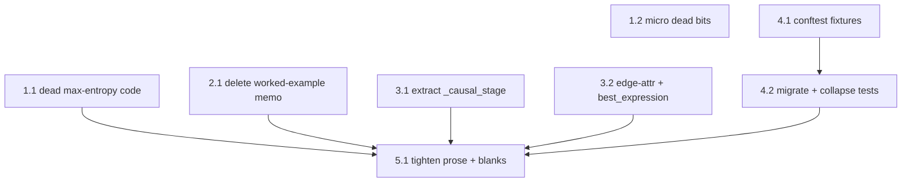
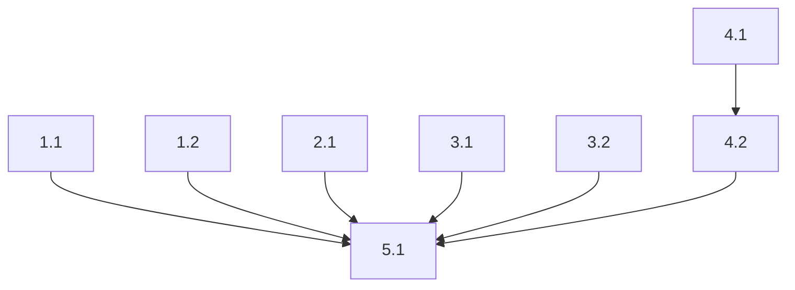

# Refactoring Roadmap — Shrink ≥20% (v2)

**Project:** Theme-to-Trade Conversion Engine (`engine/` + `tests/`)
**Date:** 2026-06-07
**Findings consolidated:** 19 (8 PR-review + 12 code-review, deduped to 11 work items)
**Baseline:** engine 4,096 + tests 2,403 = **6,499 LOC**. Target: **−20% ≈ 1,300 LOC**, all 186 tests + golden master green at every step.

## Executive Summary

Two independent reviews (PR-review-toolkit + in-depth code-review) agree: the engine is
correct and well-structured, so a 20% cut cannot come from deletion of logic alone
(behaviour-preserving code deletion ≈ 6–7%). The roadmap reaches ≥20% by stacking four
levers — excise dead max-entropy scaffolding, delete the untested 168-line worked-example
memo (a duplicate of the tested `_render_memo`), consolidate ~2,400 LOC of tests behind a
`conftest.py`, and tighten the ~1,088 LOC of inline design-narrative + excess blank lines.
**The prose phase (5.1) is the gap-closer and an explicit, reversible information tradeoff;
without it the realistic floor is ~12%.**

## Consolidated Findings (deduped by location)

| Work item | Finding IDs (merged) | Severity | Location | Est. LOC saved |
|---|---|---|---|---:|
| Dead `solve_max_entropy_q` shim | PR-001, CR-STYLE-001 | 🟠 | `engine2.py:157-167` | 12 |
| SLSQP cross-check + its only test | PR-002, CR-STYLE-002 | 🟠 | `engine2.py:170-197`, `test_solve_q_tilt.py:68-74` | 40 |
| Unused import alias / micro-dead | CR-STYLE-003, CR-STYLE-004 | 🟡 | `test_system_stages.py:20`, `engine2.py:120-128` | 5 |
| Untested worked-example memo | **PR-003, CR-SOLID-001** | 🔴 | `example.py:124-345` | 165 |
| Shared causal stage in 2 runners | CR-DRY-004 | 🟠 | `workflow.py:113-211` | 22 |
| Edge-attribution dup + best-expr | CR-DRY-005, CR-DRY-006 | 🟡 | `engine2.py:282-397`, `workflow/cases/example` | 20 |
| `conftest.py` (fixtures+helpers) | **PR-004, CR-DRY-001/002/003/007** | 🟠 | `tests/` (9 files) | enabler |
| Collapse duplicate/param tests | PR-005, PR-006 | 🟡 | `tests/` (6 files) | 250 |
| Tighten docstrings + blanks | **PR-007** | 🟠 | `engine/` + `engine/schema/` | 785 |
| Generate wiki family pages | PR-008 | 🔵 | `wiki/strategy-families/` | 0 (deferred) |

**Planned reduction:** 12+40+5+165+22+20+250+785 = **1,299 LOC ≈ 20.0%.**

## Dependency Graph

## Parallel Tracks

| Track | Steps | Theme | Can start immediately? |
|---|---|---|---|
| A | 1.1 → 1.2 | Dead-code excision | Yes |
| B | 2.1 | Memo deletion (biggest single win) | Yes |
| C | 3.1 → 3.2 | Code de-duplication | Yes |
| D | 4.1 → 4.2 | Test consolidation | Yes |
| E | 5.1 | Prose/whitespace tightening (gap-closer) | After A–D settle |

---

## Phase 1: Dead-Code Excision — Quick Wins
**Target:** zero unreferenced functions/imports in `engine2.py`; ~57 LOC gone.
**Effort:** small.

### Step 1.1: Excise dead max-entropy scaffolding
**Finding IDs:** PR-001, CR-STYLE-001, PR-002, CR-STYLE-002
**Priority score:** 4×2 − 2 − 1 = 5
**Scope:** multi-module
**Risk level:** low

**What changes:**
- Delete `solve_max_entropy_q` (`engine2.py:157-167`) — grep-verified zero callers (the engines.py re-export that used it is already gone).
- Delete `_solve_max_entropy_slsqp` (`engine2.py:170-197`) and its sole test `test_matches_slsqp_solver` (`test_solve_q_tilt.py:68-74`); drop the now-unused `from scipy.optimize import minimize`.

**What doesn't change:**
- `solve_q_tilt`/`run_pricing` and all golden-master numbers; the closed-form tilt remains the only solver.

**Verification:**
- [ ] All remaining tests pass (186 − 1 removed = 185).
- [ ] `grep -rn "solve_max_entropy_q\|_solve_max_entropy_slsqp\|minimize" engine tests` returns nothing.

**Depends on:** none
**Blocks:** 5.1
**Rollback:** `git checkout engine/engine2.py tests/unit/test_solve_q_tilt.py`.

### Step 1.2: Remove micro-dead bits
**Finding IDs:** CR-STYLE-003, CR-STYLE-004
**Priority score:** 2×2 − 2 − 1 = 1
**Scope:** multi-module
**Risk level:** low

**What changes:**
- Drop the unused `SystemMap as _SM` alias (`test_system_stages.py:20`).
- Collapse the twin manual root-bracketing loops (`engine2.py:120-128`) into one `_expand_bracket` helper.

**What doesn't change:**
- Solver behaviour; test outcomes.

**Verification:**
- [ ] All tests pass.
- [ ] `solve_q_tilt` still finds the same `q` on the golden case (edge == 20.0).

**Depends on:** none
**Blocks:** 5.1
**Rollback:** revert the two files.

---

## Phase 2: Delete the Untested Worked-Example Memo
**Target:** `example.py` ≈ 382 → ~215 LOC; the worked example reuses the tested memo renderer.
**Effort:** small.

### Step 2.1: Replace the 168-line MEMO with the workflow's rendered memo
**Finding IDs:** PR-003, CR-SOLID-001
**Priority score:** 5×2 − 1 − 1 = 8  *(load-bearing — largest single reduction)*
**Scope:** single-module
**Risk level:** low

**What changes:**
- Delete the 168-line `MEMO` f-string and its `scenario_rows`/`falsifier_rows`/`q_s_fmt` builders in `example.py` (grep-verified: no test asserts memo CONTENT).
- `run_workflow` already returns `(theme, memo)` — capture that `memo` into the `build_example()` bundle as `.memo`; `main()` prints `ex.memo`.

**What doesn't change:**
- The structured bundle fields imported by `test_golden_master` (`theme/pricing/sizing/expr_*/omega_steepener/score_val`); `build_example()` stays lazy + cached; golden numbers.

**Verification:**
- [ ] All tests pass; `test_golden_master` unchanged.
- [ ] `python -m engine.example` runs and prints a (shorter) memo.
- [ ] `grep -n "MEMO\|scenario_rows\|falsifier_rows" engine/example.py` returns nothing.

**Depends on:** none
**Blocks:** 5.1
**Rollback:** `git checkout engine/example.py`.

---

## Phase 3: Code De-Duplication
**Target:** the two workflow runners and the two edge-attribution sites share one implementation; ~42 LOC gone.
**Effort:** small.

### Step 3.1: Extract `_causal_stage` from the two runners
**Finding IDs:** CR-DRY-004
**Priority score:** 3×2 − 1 − 1 = 4
**Scope:** single-module
**Risk level:** low

**What changes:**
- `_run_discovery` and `_run_expression` (`workflow.py`) share the expand_causal → system_map → critique → loop_diagnosis block; extract a `_causal_stage(provider, ctx, thesis)` returning that bundle and call it from both.

**What doesn't change:**
- Discovery firewall (blocked/routed) and expression behaviour; no fallback semantics change.

**Verification:**
- [ ] All tests pass (discovery firewall + golden master).
- [ ] Both runners call `_causal_stage`; the block appears once.

**Depends on:** none
**Blocks:** 5.1
**Rollback:** revert `workflow.py`.

### Step 3.2: Dedup edge-attribution + add `ThemeObject.best_expression()`
**Finding IDs:** CR-DRY-005, CR-DRY-006
**Priority score:** 3×2 − 2 − 1 = 3
**Scope:** multi-module
**Risk level:** low

**What changes:**
- Extract the per-scenario `EdgeContribution` build shared by `compute_edge_mc` and `run_pricing` (`engine2.py`) into one helper.
- Add `ThemeObject.best_expression()` (max scored expression) and call it from the 4 sites that re-implement "best scored expression" (`workflow`, `cases`, `example`).

**What doesn't change:**
- `edge_attribution` ordering/values; the selected best expression; golden score.

**Verification:**
- [ ] All tests pass; `best score == 3.918220233274124`.
- [ ] One edge-attribution builder; `best_expression()` used at all 4 sites.

**Depends on:** none
**Blocks:** 5.1
**Rollback:** revert the touched files.

---

## Phase 4: Test Consolidation
**Target:** a `conftest.py` owns case-loading, builders, golden constants, and oracle asserts; ~2,403 → ~2,150 test LOC.
**Effort:** medium.

### Step 4.1: Create `tests/conftest.py` with shared fixtures
**Finding IDs:** PR-004, CR-DRY-001, CR-DRY-002, CR-DRY-003, CR-DRY-007
**Priority score:** 4×2 − 2 − 1 = 5  *(enabler)*
**Scope:** multi-module
**Risk level:** low

**What changes:**
- Add `conftest.py` exposing: `cases_dir`, `build_theme(case_name, mode)` (load_case→ScriptedProvider→run_workflow), AI-issuance `scenarios()`/`axis()` builders, golden constants (q-vector/edge/score), and `assert_oracle_passes(case, theme)`.

**What doesn't change:**
- Any test assertion or outcome (additive — nothing migrated yet).

**Verification:**
- [ ] All tests pass (conftest added, unused so far).
- [ ] `conftest.py` imports cleanly; fixtures resolve.

**Depends on:** none
**Blocks:** 4.2
**Rollback:** delete `conftest.py`.

### Step 4.2: Migrate test files to fixtures; collapse duplicate/param tests
**Finding IDs:** PR-004, PR-005, PR-006, CR-DRY-001, CR-DRY-002, CR-DRY-003, CR-DRY-007, CR-STYLE-003
**Priority score:** 5×2 − 4 − 2 = 4  *(load-bearing — ~250 LOC)*
**Scope:** cross-cutting
**Risk level:** medium

**What changes:**
- Replace the 24 repeated `load_case→run_workflow` call-sites and 9 cases-path literals with the `conftest` fixtures.
- Collapse the 4 per-case parametrized re-runs in `test_cases.py` into one `run_case`; hoist re-declared AI-issuance vectors and golden literals to the fixtures; replace repeated `assert not failed` with `assert_oracle_passes`.

**What doesn't change:**
- The set of behaviours asserted (every existing assertion still runs, via fixtures); coverage.

**Verification:**
- [ ] Test COUNT is preserved or intentionally reduced only where tests were exact duplicates (note any drop).
- [ ] Full suite green; golden master intact.
- [ ] `grep -rn "load_case(.*ai_issuance" tests | wc -l` drops sharply.

**Depends on:** 4.1
**Blocks:** 5.1
**Rollback:** `git checkout tests/`.

---

## Phase 5: Prose & Whitespace Tightening — the Gap-Closer
**Target:** inline design-narrative halved and excess blank lines normalized; ~785 LOC, closing the gap to ≥20%.
**Effort:** medium (mechanical, cross-cutting).

### Step 5.1: Tighten docstrings/comments + normalize blank lines
**Finding IDs:** PR-007
**Priority score:** 5×2 − 5 − 1 = 4  *(load-bearing — without it the floor is ~12%)*
**Scope:** cross-cutting
**Risk level:** low

**What changes:**
- Compress multi-paragraph design-rationale docstrings in `engine2.py`, `cases.py`, `stage0.py`, `workflow.py`, `firewall.py`, `runner.py`, and `engine/schema/*` to a one-line summary + essential contract; move long rationale to `reviews/` design notes.
- Normalize runs of ≥2 blank lines to single within functions (keep PEP-8 top-level spacing).
- Done LAST so prose is tightened once, on already-moved/deleted code.

**What doesn't change:**
- Any code, signature, or behaviour; only comments/docstrings/whitespace.

**Verification:**
- [ ] All tests pass (no code touched).
- [ ] `git diff --stat` shows comment/blank-only changes in engine/ + schema/.
- [ ] engine+tests LOC ≤ 5,200 (≥20% below 6,499).

**Depends on:** 1.1, 1.2, 2.1, 3.1, 3.2, 4.2
**Blocks:** none
**Rollback:** `git checkout` the prose-only diffs.

---

## Expected Outcome

| Metric | Before | After (target) |
|---|---|---|
| engine + tests LOC | 6,499 | ≤ 5,200 (**−20.0%**) |
| Dead functions in engine2 | 2 (+1 test) | 0 |
| Worked-example memo | 168 LOC, untested, duplicate | reuses tested `_render_memo` |
| Repeated `load_case→run_workflow` | 24 sites | conftest fixtures |
| Inline design-narrative | ~1,088 LOC | ~halved (pushed to design notes) |

## What This Plan Does NOT Address

- **PR-008** (generate wiki family pages) — outside the engine+tests LOC baseline (0 toward target); do opportunistically.
- **Logic-bearing structural cuts** (e.g. collapsing the Oracle union, thinning the scripted seams) — deferred: medium-risk and they trade size for the very extensibility the architecture review rated 🟢. Not worth it for LOC.
- **Honest ceiling note:** Phases 1–4 alone deliver ~514 LOC (~8%); **Phase 5 (prose) is required to reach 20%** and is an information tradeoff. If you'd rather keep the design narrative inline, the behaviour- and narrative-preserving floor is ~12% (Phases 1–4 + light prose) — decide at the gate.

## Handoff

### Dependency DAG

### Expected Outcome
| Metric | Before | After |
|---|---|---|
| engine+tests LOC | 6,499 | ≤ 5,200 (−20%) |
| Dead code (functions/imports) | 3 | 0 |
| Test boilerplate (load/run sites) | 24 | conftest |

### Phase 1 — Dead-Code Excision
**Step 1.1** — Status: PENDING
- Finding IDs: PR-001, CR-STYLE-001, PR-002, CR-STYLE-002
- Scope: multi-module
- Risk: low
- What changes: delete `solve_max_entropy_q`, `_solve_max_entropy_slsqp`, its sole test, and the `minimize` import.
- What doesn't change: `solve_q_tilt`/`run_pricing`, golden numbers.
- Verification: [ ] suite green (185) [ ] grep finds no removed symbols
- Depends on: none
- Blocks: 5.1

**Step 1.2** — Status: PENDING
- Finding IDs: CR-STYLE-003, CR-STYLE-004
- Scope: multi-module
- Risk: low
- What changes: drop unused `_SM` alias; fold twin bracket-expansion loops into one helper.
- What doesn't change: solver behaviour.
- Verification: [ ] suite green [ ] edge == 20.0 on golden case
- Depends on: none
- Blocks: 5.1

### Phase 2 — Delete Untested Memo
**Step 2.1** — Status: PENDING
- Finding IDs: PR-003, CR-SOLID-001
- Scope: single-module
- Risk: low
- What changes: delete the 168-line `MEMO` + row builders in `example.py`; expose `run_workflow`'s returned memo as `bundle.memo`.
- What doesn't change: golden-master bundle fields; `build_example()` lazy/cached.
- Verification: [ ] suite green [ ] `python -m engine.example` prints a memo [ ] no `MEMO`/`scenario_rows` left
- Depends on: none
- Blocks: 5.1

### Phase 3 — Code De-Duplication
**Step 3.1** — Status: PENDING
- Finding IDs: CR-DRY-004
- Scope: single-module
- Risk: low
- What changes: extract `_causal_stage` shared by `_run_discovery`/`_run_expression`.
- What doesn't change: firewall + expression semantics.
- Verification: [ ] suite green [ ] block appears once
- Depends on: none
- Blocks: 5.1

**Step 3.2** — Status: PENDING
- Finding IDs: CR-DRY-005, CR-DRY-006
- Scope: multi-module
- Risk: low
- What changes: one edge-attribution builder; add `ThemeObject.best_expression()` and use at 4 sites.
- What doesn't change: `edge_attribution` values; best score 3.918…
- Verification: [ ] suite green [ ] one builder; helper used at 4 sites
- Depends on: none
- Blocks: 5.1

### Phase 4 — Test Consolidation
**Step 4.1** — Status: PENDING
- Finding IDs: PR-004, CR-DRY-001, CR-DRY-002, CR-DRY-003, CR-DRY-007
- Scope: multi-module
- Risk: low
- What changes: add `tests/conftest.py` with `cases_dir`, `build_theme`, AI-issuance builders, golden constants, `assert_oracle_passes`.
- What doesn't change: any assertion (additive).
- Verification: [ ] suite green [ ] fixtures resolve
- Depends on: none
- Blocks: 4.2

**Step 4.2** — Status: PENDING
- Finding IDs: PR-004, PR-005, PR-006, CR-DRY-001, CR-DRY-002, CR-DRY-003, CR-DRY-007, CR-STYLE-003
- Scope: cross-cutting
- Risk: medium
- What changes: migrate 24 load/run sites + 9 path literals to fixtures; collapse duplicate/param tests; centralize golden literals + oracle asserts.
- What doesn't change: behaviours asserted; coverage.
- Verification: [ ] suite green [ ] note any intentional test-count drop [ ] load_case duplication drops sharply
- Depends on: 4.1
- Blocks: 5.1

### Phase 5 — Prose & Whitespace Tightening
**Step 5.1** — Status: PENDING
- Finding IDs: PR-007
- Scope: cross-cutting
- Risk: low
- What changes: compress design-narrative docstrings to one-line summary + contract; normalize ≥2 blank-line runs within functions; move long rationale to design notes.
- What doesn't change: any code/signature/behaviour.
- Verification: [ ] suite green [ ] diff is comment/blank-only [ ] engine+tests LOC ≤ 5,200 (−20%)
- Depends on: 1.1, 1.2, 2.1, 3.1, 3.2, 4.2
- Blocks: none
