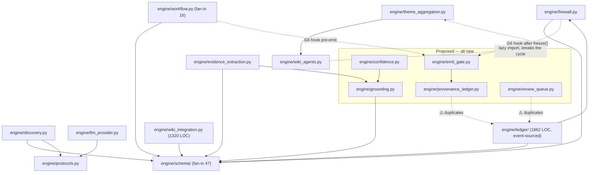

# Architecture Review Report

**Project:** creditmacro
**Date:** 2026-08-09
**Files reviewed:** 81 engine modules (12,673 LOC) + 5 `PLAN-*.md` proposals
**Overall health:** 🟢 Sound — one duplication to resolve before building

**Scope note.** This review was commissioned to evaluate the *blast radius* of two design
documents written 2026-08-09 — `PLAN-authoritative-harness.md` (613 lines, eight
anti-hallucination guardrails) and `PLAN-theme-lifecycle.md` (301 lines, five theme-layer
gaps) — against the architecture as it stands. It supersedes
`reviews/2026_06_06_architecture_review_v2.md` as the current baseline: the engine has grown
from 4,096 LOC to 12,673 since that review, so its scores no longer describe this codebase.

## Codebase Summary

creditmacro turns third-party research markdown into ranked credit strategy families through
an LLM-in-the-loop pipeline whose defining choice is that authority stays in deterministic
code — the model proposes, the harness disposes. `engine/` holds 81 modules: a flat top level
of roughly 45 domain modules (`discovery`, `workflow`, `firewall`, `surveillance`,
`evidence_extraction`, `engine2`, `theme_aggregation`), a `schema/` package of frozen Pydantic
models split out of a 732-line monolith during the June refactor, and a `ledger/` subpackage
(1,862 LOC) implementing an event-sourced bitemporal "Theme Hypothesis Ledger" with its own
substrate, ingest passes and wiki projection. Safety rests on four mechanisms that already
work: a two-phase memory firewall, content-hashed frozen snapshots with an explicit hash
exclusion list, a golden master locked to 1e-6, and a verbatim-leak check. Entry points are
`tools/` CLI scripts and the `engine.workflow.run_workflow` / `engine.firewall.run_two_phase`
pair. 862 tests run in ~90s and are verifiably hermetic — no network, no credentials, no
database.

## Scorecard

| Dimension | Score | Key Finding |
|---|---|---|
| Boundary Quality | 🟡 | Flat top level of ~45 modules; the plans add 8 more to it |
| Dependency Direction | 🟡 | One real cycle, already survived by a deferred import |
| Abstraction Fitness | 🟢 | Protocols at the LLM seams; frozen Pydantic at boundaries |
| DRY & Knowledge | 🟠 | Plans propose a ledger and review queue that already exist |
| Extensibility | 🟢 | 12 of 12 proposed modules are new; changes are additive |
| Testability | 🟢 | 862 hermetic tests, golden master, ~90s |
| Parallelisation | 🟡 | Deferred as AR-PAR-001 in June; still deferred |

**Overall: 🟢 Sound — the plans are low-risk in shape, but one duplication should be resolved
before Phase 3 rather than after.**

## Blast radius assessment

**The proposals are overwhelmingly additive, which is the low-risk shape.** All twelve modules
named across the two plans are new — `grounding.py`, `confidence.py`, `emit_gate.py`,
`adjudication.py`, `sanitize.py`, `model_manifest.py`, `provenance_ledger.py`,
`review_queue.py`, and four `schema/` modules. None exists today. Additive work cannot
regress what it does not touch.

**The blast radius is therefore concentrated in three places, not twelve:**

| Surface | Fan-in | Why it matters |
|---|---:|---|
| `engine/schema` | **47 modules** | Both plans add fields to frozen models (`EvidenceAtom`, `ThemeObject`). Highest-fan-in surface in the repo. |
| `engine/workflow.py` | 16 modules | G6's emit gate hooks `run_workflow` before `strategy_family_routed`. |
| `engine/firewall.py` | 5 modules | G6 hooks `run_two_phase` after `freeze()`. |

**The mitigation is proven, not speculative.** `engine/firewall.py:21` already carries
`_HASH_EXCLUDE`, and `forward_horizon` was added by exactly the route the plans propose, with
the comment *"an additive Phase-1 field; exclude it so existing snapshot hashes stay
byte-identical."* The plans' invariant I6 restates a technique this repo has already executed
successfully. That materially de-risks the schema work.

**Sequencing is a constraint, not a parallelisation opportunity.** The harness plan's own
dependency spine is Grounding Kernel → G1/G2 → G4 → G6 → G8, with G5 and G7 orthogonal. At
most two guardrails ship per phase. The theme-lifecycle plan is more serial still: L1 first,
L2 and L3 after L1, L4 after L1+L3, L5 last — one genuinely parallel pair in five items. Any
attempt to fan this work out across agents will be bounded by that spine rather than by
available capacity.

## Dependency Graph

## Detailed Findings

### AR-DRY-001: The plans propose a provenance ledger and a review queue that already exist

- **Finding ID:** AR-DRY-001
- **Dimension:** DRY & Knowledge
- **Severity:** 🟠
- **Location:** `PLAN-authoritative-harness.md:264-282` (G6), `:425-435` (D1),
  `:472-477` (D5) vs `engine/ledger/` and `engine/ledger/wiki/review_queue.py`
- **Principle violated:** DRY / knowledge duplication — two stores for one concept
- **Evidence:** D5 specifies *"A real database file, mirroring the existing `thesis_tracker.py`
  + `db/migrations/0001,0002` pattern: `db/migrations/0003_provenance_ledger.sql`, append-only,
  audit-logged."* D1 specifies a confirmation gate at `engine/review_queue.py`.

  Meanwhile `engine/ledger/` is a 1,862-LOC event-sourced bitemporal substrate whose own
  docstring reads *"Theme Hypothesis Ledger — Alaph Stage-1 substrate (event-sourced,
  bitemporal)... reuses schema, memory firewall, surveillance, llm_provider, firewall.freeze,
  discovery."* It contains `substrate/store.py`, `substrate/events.py`, `substrate/identity.py`,
  `substrate/fold.py`, and `projection.py`. Seven of its files already reference provenance or
  spans.

  `engine/ledger/wiki/review_queue.py` opens: *"Append-only, human-gated review queues
  (ONTOLOGY §Admission, §Rendered view). Three sinks, nothing auto-applied."* That is the same
  shape as D1's Tier C gate — queue a candidate, ask a human, never auto-apply.

  **`PLAN-authoritative-harness.md` does not mention `engine/ledger` anywhere.** Grep for
  `engine/ledger`, `substrate`, `hypothesis ledger`, `event-sourced`: no matches.
- **Impact:** Building G6 as specified leaves the repo with two provenance stores of different
  shapes (flat SQLite append-only vs event-sourced bitemporal) and no defined relationship
  between them. Queries like *"show me every claim that rests on this source"* — D5's stated
  motivation — would have two possible answers. The review queue would exist twice outright.
- **Recommendation:** Reconcile before Phase 3 begins, not after. Either extend the existing
  substrate with the `LedgerNode` kinds G6 needs, or state explicitly in the plan why the
  grounding ledger must be a separate store. The plan is careful and well-reasoned elsewhere;
  this reads like the author did not have `engine/ledger` in view, which is understandable
  given it is a subpackage of its own with separate ONTOLOGY docs.

### AR-BND-001: The engine top level is flat, and the plans would add eight more modules to it

- **Finding ID:** AR-BND-001
- **Dimension:** Boundary Quality
- **Severity:** 🟡
- **Location:** `engine/` (~45 top-level modules)
- **Principle violated:** Rate-of-change alignment / navigability
- **Evidence:** `engine/` holds roughly 45 modules at its top level alongside two subpackages
  (`schema/`, `ledger/`) that demonstrate the codebase already knows how to group. The plans
  add `grounding.py`, `confidence.py`, `emit_gate.py`, `adjudication.py`, `sanitize.py`,
  `model_manifest.py`, `provenance_ledger.py`, `review_queue.py` — all top-level.
- **Impact:** These eight are one concern, not eight. They share a lifecycle (they ship
  together across six phases), a purpose (grounding), and a dependency (the Grounding Kernel).
  Scattered at top level they read as eight unrelated additions.
- **Recommendation:** Group them as `engine/grounding/` with the kernel at its root, matching
  how `ledger/` is already organised. This is cheap while the modules do not yet exist and
  expensive afterwards.

### AR-DEP-001: A real import cycle between theme_aggregation and wiki_agents

- **Finding ID:** AR-DEP-001
- **Dimension:** Dependency Direction
- **Severity:** 🟡
- **Location:** `engine/theme_aggregation.py:33`, `engine/wiki_agents.py:559`
- **Principle violated:** Acyclic dependency graph
- **Evidence:** `theme_aggregation.py:33` does a module-level
  `from engine.wiki_agents import SourceClassification`. `wiki_agents.py:559` imports back from
  `theme_aggregation` inside a function, with the comment *"lazy import: theme_aggregation
  imports SourceClassification from this module."* The cycle is known and deliberately
  survived rather than resolved. These are the second and fourth largest modules (659 and 620
  LOC).
- **Impact:** Contained today. But a deferred import is a workaround with no test protecting
  it — anyone promoting that import to module level gets an `ImportError` at a distance.
  Neither plan touches these modules, so this is not on the critical path.
- **Recommendation:** `SourceClassification` is a type shared by both. Moving it to
  `engine/schema/` — where 47 modules already look for shared types — would break the cycle
  without either module changing behaviour.

### AR-BND-002: wiki_integration.py is 1,320 LOC, 60% larger than the next module

- **Finding ID:** AR-BND-002
- **Dimension:** Boundary Quality
- **Severity:** 🟡
- **Location:** `engine/wiki_integration.py`
- **Principle violated:** Single Responsibility
- **Evidence:** 1,320 LOC against a next-largest of 821 (`wiki_validators.py`) and a median far
  below that.
- **Impact:** Not urgent — neither plan touches it. Flagged because it is where the next
  boundary problem will surface, and because the June shrink effort explicitly stopped short
  of it.
- **Recommendation:** Leave it until something needs to change inside it; split along the seam
  that change reveals rather than guessing one now.

### AR-TST-001: The June baselines no longer describe this codebase

- **Finding ID:** AR-TST-001
- **Dimension:** Testability
- **Severity:** 🟡
- **Location:** `reviews/2026_06_06_architecture_review_v2.md`,
  `reviews/2026_06_07_engine_review_v2.md`
- **Principle violated:** Stale baseline
- **Evidence:** `PLAN-engine-shrink.md` records a post-shrink state of 5,156 LOC across engine
  and tests, and the June reviews score an engine of 4,096 LOC with 186 tests. Today: 12,673
  engine LOC, 11,025 test LOC, 862 tests. Roughly 3× growth, no architecture review in between.
- **Impact:** Those scores are quoted in `PLAN-engine-refactor.md` as the baseline the refactor
  improved. Treating them as current would understate today's structure by a wide margin.
- **Recommendation:** Treat this report as the baseline. Re-run before the next phase boundary,
  not on a calendar.

### AR-EXT-001: Missing dependency declaration breaks a clean clone

- **Finding ID:** AR-EXT-001
- **Dimension:** Extensibility
- **Severity:** 🟡 (fixed during this review)
- **Location:** `requirements_engine.txt`, `tools/convert_pdf_to_markdown.py:21`
- **Principle violated:** Reproducible environment
- **Evidence:** `import fitz` at module level with PyMuPDF undeclared. A fresh clone could not
  *collect* two test files — pytest stopped rather than reported. The comment at
  `tests/unit/test_convert_pdf.py:4` claims PyMuPDF arrives *"via pymupdf4llm"*; pymupdf4llm is
  neither installed nor declared, and is imported in a try/except that degrades silently.
- **Impact:** Any environment built from the requirements file cannot run the suite — which
  matters directly, because that suite is the intended merge gate for parallel agent work.
- **Recommendation:** Declared as `pymupdf>=1.24` (commit `60604d4`). Note separately that
  every PDF converted to date has used the fallback engine, recorded as `engine="pymupdf"` in
  the manifests, rather than the primary `pymupdf4llm` the design docs describe.

## Positive Highlights

**The hash-exclusion discipline is the strongest thing in this codebase.** `_HASH_EXCLUDE` at
`engine/firewall.py:21` with a comment explaining precisely why `forward_horizon` is excluded
means additive schema change is safe *and provable*. Both plans lean on it, correctly.

**The test suite is hermetic, and that is rarer than it sounds.** Verified directly: 862 tests
pass with outbound sockets blocked and every API key unset. Everything they read is committed.
This is what makes the suite usable as a merge gate for isolated parallel work.

**Fan-out is genuinely low.** No module imports more than five other engine modules. For 81
modules and 12,673 LOC that is unusual, and it is why one localised cycle is the only
dependency finding.

**Both plans are unusually disciplined design documents.** They state invariants with gate
commands, mark each item deterministic or LLM-fenced, resolve their own open questions, and
declare what they do *not* change. `PLAN-authoritative-harness.md:488-499` exists purely to
stop a builder duplicating the priced-in machinery. The one thing that discipline missed is
AR-DRY-001 — which is exactly the failure that section was written to prevent, one level up.

## Recommended Review Cadence

Re-run at the next phase boundary rather than on a schedule — specifically before Phase 3 of
the harness plan, since that is where G6 lands and where AR-DRY-001 becomes expensive to
resolve. Also re-run if `engine/` passes ~100 modules, or if `wiki_integration.py` is opened
for substantial change.

## Handoff

| Dimension | Score | Key Finding |
|---|---|---|
| Boundary Quality | 🟡 | Flat top level of ~45 modules; the plans add 8 more to it |
| Dependency Direction | 🟡 | One real cycle, already survived by a deferred import |
| Abstraction Fitness | 🟢 | Protocols at the LLM seams; frozen Pydantic at boundaries |
| DRY & Knowledge | 🟠 | Plans propose a ledger and review queue that already exist |
| Extensibility | 🟢 | 12 of 12 proposed modules are new; changes are additive |
| Testability | 🟢 | 862 hermetic tests, golden master, ~90s |
| Parallelisation | 🟡 | Deferred as AR-PAR-001 in June; still deferred |

- **AR-DRY-001** · 🟠 · DRY · `PLAN-authoritative-harness.md:264-282,425,472` vs
  `engine/ledger/` — G6 and D1 specify a provenance ledger and a human-gated review queue that
  already exist as a 1,862-LOC event-sourced substrate; the plan never mentions it. Resolve
  before Phase 3 or the repo gains two provenance stores with no defined relationship.
- **AR-BND-001** · 🟡 · Boundaries · `engine/` — eight proposed modules are one concern
  (grounding) scattered across an already-flat top level of ~45 modules; group them while they
  do not yet exist.
- **AR-DEP-001** · 🟡 · Dependencies · `engine/theme_aggregation.py:33`,
  `engine/wiki_agents.py:559` — a real module-level cycle survived by an untested deferred
  import; moving `SourceClassification` into `engine/schema/` breaks it.
- **AR-BND-002** · 🟡 · Boundaries · `engine/wiki_integration.py` — 1,320 LOC, 60% larger than
  the next module; not on either plan's path, but the next boundary problem to surface.
- **AR-TST-001** · 🟡 · Testability · `reviews/2026_06_*` — baselines describe a 4,096-LOC
  engine against today's 12,673; their scores cannot be used as a current reference.
- **AR-EXT-001** · 🟡 · Extensibility · `requirements_engine.txt` — PyMuPDF imported
  unconditionally but undeclared, so a clean clone could not collect two test files; fixed in
  commit `60604d4`.
