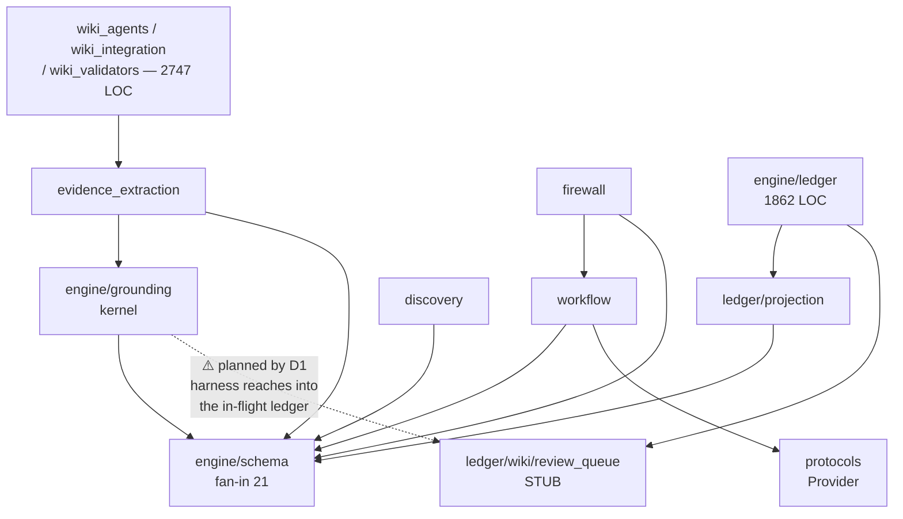

# Architecture Review Report

**Project:** creditmacro — Theme-to-Trade Conversion Engine
**Date:** 2026-08-10
**Files reviewed:** 85 engine modules (13,277 LOC) + 98 test modules; three plan documents
**Overall health:** 🟡 Adequate — the structure is sound and can carry most of what the plans specify, but two binding decisions in the plans rest on false premises about the code

> Finding IDs continue from `reviews/2026_08_09_architecture_review.md`, which already issued
> `AR-BND-001` and `AR-DRY-001`. Both were adopted into `PLAN-authoritative-harness.md`; their
> status is verified below.

## Codebase Summary

`creditmacro` converts research markdown into falsifiable investment hypotheses and stops at a PM
memo. `engine/` holds 35 top-level modules plus three subpackages: `schema/` (Pydantic contracts,
a pure re-export barrel), `ledger/` (a 1,862-LOC event-sourced bitemporal substrate with its own
`substrate/`, `ingest/` and `wiki/` layers), and the new `grounding/` (the anti-hallucination
kernel). Flow is Stage 0 ingestion → `workflow.run_workflow` over a frozen `ThemeObject` →
`firewall.run_two_phase` enforcing the method/case memory split → `discovery` routing to ranked
strategy families. LLM access sits behind a `Provider` Protocol in `protocols.py` with
`scripted_provider` for tests and `provider_select` reading the only environment variable in the
codebase — and reading it from an injected `env` parameter. Entry points are `example.py`,
`live_discovery.py` and the ledger's `runner.forward_ingest`.

## Scorecard

| Dimension | Score | Key Finding |
|---|---|---|
| Boundary Quality | 🟡 | Wiki concerns split across 2,747 LOC at top level and a subpackage inside `ledger/`; `grounding/` is grouped by plan phase, not by change rate |
| Dependency Direction | 🟢 | No cycles; `ledger/` has exactly one upward import; `grounding/` depends only on its schema. One binding decision will break this |
| Abstraction Fitness | 🟡 | Twelve `NotImplementedError` stubs are read by the plans as finished modules |
| DRY & Knowledge | 🟠 | The activation rule exists in two places; wave 1 fixed one. Strategy-family knowledge has a typed home that one producer bypasses |
| Extensibility | 🟡 | Next plan phases (G4, L1) land in 2–3 files each; adding a strategy family still touches 4 |
| Testability | 🟢 | 591 unit tests in 26s, no network, providers swappable by Protocol |
| Parallelisation | 🟡 | Per-source extraction is embarrassingly parallel and sequential today; not yet a bottleneck |

**Overall: 🟡 Adequate** — the bones are good. The risk is not in the structure but in what the
plans believe about it.

## Dependency Graph



The solid edges are the actual import graph and it is a clean DAG. The dashed edge is what
decision D1 mandates next.

## Detailed Findings

### AR-ABS-002: D1 is binding, and it rests on a module that does nothing
- **Dimension:** Abstraction Fitness
- **Severity:** 🔴 Critical
- **Location:** `engine/ledger/wiki/review_queue.py:21-23`; `PLAN-authoritative-harness.md:460-467`
- **Principle violated:** Decisions must rest on verified premises
- **Evidence:** D1's correction, dated 2026-08-09, reads: *"One already exists, it is 23 lines...
  there is no argument for a second implementation here: **it is small, finished, and already
  does this**."* The file's only function is:
  ```python
  def enqueue(queue: Queue, item: dict) -> None:
      raise NotImplementedError("Phase 0/7 — append-only JSONL per queue")
  ```
  It has zero callers anywhere in `engine/` or `tests/`. It is 23 lines because it is a stub, not
  because it is compact.
- **Impact:** §5 of the plan states its decisions are *"binding on the build; a builder does not
  need to re-litigate them."* A builder implementing Tier C would add a fourth enum member to a
  function that raises, discover there is no queue, and either stop or invent one — the exact
  outcome D1 was written to prevent. The prior review inferred "finished" from a docstring and a
  line count.
- **Recommendation:** Re-scope D1 to say the review queue's *shape* is the right one and its
  *implementation* is Phase 0/7 work that Tier C now pulls forward. That is a different, larger
  decision than "add a fourth sink", and the sequencing table should show it.

---

### AR-DRY-002: The activation rule lives in two places; wave 1 fixed one of them
- **Dimension:** DRY & Knowledge Duplication
- **Severity:** 🟠 Weak
- **Location:** `engine/ledger/runner.py:84` vs `engine/ledger/lifecycle.py:4,20`
- **Principle violated:** Single source of truth for a business rule
- **Evidence:** Wave 1 task 1.5 correctly removed the sign-blindness from the runner:
  ```python
  active = sv.B >= ACTIVATION_BREADTH_MIN and sv.S >= ACTIVATION_ABS_SCORE_MIN
  ```
  `lifecycle.py` still carries the original rule in two forms — its module docstring
  (`CANDIDATE → ACTIVE iff B_θ ≥ ACTIVATION_BREADTH_MIN ∧ |S_θ| ≥ ACTIVATION_ABS_SCORE_MIN`) and
  the stub message at line 20 (`B ≥ 2 ∧ |S| ≥ 2`). That module's own docstring says it *"Governs
  the MARKET-TRUTH status axis only"* — so the authoritative home of the rule is the copy that was
  not fixed.
- **Impact:** Whoever implements Phase 6 reads `lifecycle.py`, finds `|S|` specified twice, and
  reintroduces the bug wave 1 removed. The two copies cannot drift *visibly*, because one of them
  does not execute.
- **Recommendation:** The rule belongs in one place. Either `lifecycle.activation_transition(score)`
  becomes the definition and `runner.py` calls it, or `lifecycle.py` stops restating it. Given
  `runner.py` is live and `lifecycle.py` is a stub, the former is the smaller change and matches
  how `scoring_view.py` already centralises S and B.

---

### AR-DEP-002: D1 and D5 pull in opposite directions, and D1 wins by default
- **Dimension:** Dependency Direction
- **Severity:** 🟠 Weak
- **Location:** `PLAN-authoritative-harness.md:460-467` (D1) vs `:523-544` (D5); target
  `engine/ledger/wiki/review_queue.py`
- **Principle violated:** Stable dependencies — do not depend on something less stable than yourself
- **Evidence:** D5 keeps the provenance ledger separate from the hypothesis ledger, and gives the
  reason explicitly: *"The hypothesis ledger is itself mid-build... Extending a substrate that is
  still under construction would make this plan inherit every unknown remaining in that one, and
  two in-flight systems joined together is how both stall."* D1 then routes the harness's human
  gate into `engine/ledger/wiki/review_queue.py` — a module inside that same in-flight substrate,
  marked *"Phase-0/7 companion."* Today `engine/ledger/` has exactly one upward import
  (`projection.py → engine.schema.*`) and nothing outside it imports in. D1 creates the first
  inbound edge, from the newest subsystem to the least finished one.
- **Impact:** The coupling D5 refused at the store level is admitted at the queue level, for a
  component that is 23 stub lines rather than 1,862 working ones. The reasoning that justified
  separation applies here with more force, not less.
- **Recommendation:** Decide the two together, not separately. If the queue is genuinely shared
  infrastructure, it belongs above both subsystems — not inside one of them. Reuse is not the same
  as reuse *in place*.

---

### AR-BND-002: `engine/grounding/` is grouped by plan phase, not by rate of change
- **Dimension:** Boundary Quality
- **Severity:** 🟠 Weak
- **Location:** `PLAN-authoritative-harness.md:60-78` (module layout, AR-BND-001)
- **Principle violated:** Rate-of-change alignment
- **Evidence:** The decision groups eight modules on the stated grounds that *"These eight are one
  concern with one lifecycle — they ship together across six phases and all depend on the
  kernel."* Classifying them by how often each will actually change:

  | Module | Change rate | Driven by |
  |---|---|---|
  | `__init__.py` (span matching) | **static** | text, essentially never |
  | `numbers.py` | **slow** | new units and formats in sources |
  | `confidence.py` (G4) | **slow, versioned** | D4 requires a reviewed change + version bump |
  | `emit_gate.py` (G6) | **structural** | every new claim kind |
  | `sanitize.py` (G5) | **fast** | adversarial patterns, an arms race |
  | `model_manifest.py` (G7) | **fast** | every model release |

  Two of these change on an external clock nobody in this repo controls. The kernel changes never.
- **Impact:** "Ship together" is a sequencing property, not a cohesion property, and it expires the
  moment the six phases land. After that, `model_manifest.py` churns beside a file that should
  never be touched — and every churn re-tests the kernel.
- **Recommendation:** Keep `__init__.py`, `numbers.py` and `confidence.py` together as the
  deterministic kernel. `sanitize.py` and `model_manifest.py` guard the *LLM boundary*, which is
  where `prompts.py`, `llm_provider.py` and `provider_select.py` already live. The plan is right
  that eight scattered top-level modules would read as eight unrelated additions; the fix is two
  coherent groups, not one convenient one.

---

### AR-DRY-003: A typed family vocabulary exists and one producer bypasses it
- **Dimension:** DRY & Knowledge Duplication
- **Severity:** 🟠 Weak
- **Location:** `engine/evidence_extraction.py:62-67`, `:358-366` vs
  `engine/schema/theme_aggregation.py`, `engine/discovery.py:79`
- **Principle violated:** Single source of truth
- **Evidence:** The codebase does this well in one place — `theme_aggregation` defines
  `StrategyFamilyName`, `ROUTABLE_FAMILIES` and `WIKI_ONLY_FAMILIES`, and
  `tests/unit/test_theme_family_hint_typing.py:34` asserts the routable set equals
  `StrategyFamilyRec.family` exactly. Then `evidence_extraction.py:63` declares `family: str` —
  untyped — and line 358 introduces `_DOWN`, a fourth downstream-model mapping whose entries
  disagree with `discovery._DOWNSTREAM` for the same families
  (`"relative-value pair construction (downstream)"` vs
  `"pair construction + beta/notional neutralisation"`).
- **Impact:** The extractor can emit `family="curve"` and `family="sector_rotation"` — both real
  wiki taxonomy, neither routable — and nothing rejects them, because the one producer that
  skipped the Literal is the one furthest upstream. The divergence in the two downstream-model
  strings is already present, not hypothetical.
- **Recommendation:** `StrategyFamilyHint.family` should bind to `StrategyFamilyName`, which
  distinguishes routable from wiki-only and would make the hint say which it is. The existing test
  then extends to cover the extractor for free.

---

### AR-BND-003: Wiki concerns are split across two subsystems and four modules
- **Dimension:** Boundary Quality
- **Severity:** 🟡 Adequate
- **Location:** `engine/wiki_agents.py` (606), `engine/wiki_integration.py` (1,320),
  `engine/wiki_validators.py` (821), `engine/ledger/wiki/` (286)
- **Principle violated:** Single Responsibility at the package level
- **Evidence:** 2,747 LOC of wiki handling sits at the top level of `engine/`, while a separate
  `wiki/` subpackage sits inside `ledger/`. `wiki_integration.py` at 1,320 lines is the largest
  module in the repo. The two groups do not import each other.
- **Impact:** A reader asking "where does wiki rendering live" has two correct answers in
  different subsystems. This is also the boundary L1's `ThemeView` has to cut across, since the
  weekly book and PM memo both read wiki-derived state.
- **Recommendation:** Not urgent, but decide it before L4 lands a third wiki-facing consumer. The
  `schema/`, `ledger/` and `grounding/` groupings show the codebase already knows how to package a
  concern.

---

### AR-EXT-002: The next two plan phases land cleanly; the older seam does not
- **Dimension:** Extensibility
- **Severity:** 🟡 Adequate
- **Evidence:** Traced for the three most likely next changes:

  | Extension | Files to change | Verdict |
  |---|---|---|
  | **G4** computed confidence | new `grounding/confidence.py`; `probability.py` (field); `evidence_extraction.py` (drop the three named constants) | 🟡 2 existing + 1 new |
  | **L1** `ThemeView` | new `schema/theme_view.py` + `theme_view.py`; consumers migrate one at a time | 🟢 0 existing + 2 new |
  | **New strategy family** | `schema/strategy_family.py`, `schema/theme_aggregation.py`, `discovery.py` (`_ROUTE` + `_DOWNSTREAM`), `evidence_extraction.py` (`_DOWN`) | 🟠 4 existing |

  `discovery.py:143-154` dispatches on `shape`/`direction` through a table plus four hardcoded
  branches — the table is extensible, the branches are not.
- **Impact:** G4 and L1 are well-served by the current structure, which is the important result:
  the plans' next steps do not require restructuring first. Strategy families remain shotgun
  surgery, and AR-DRY-003 is why the count is 4 rather than 3.
- **Recommendation:** Nothing before G4/L1. Fold `_DOWN` into `_DOWNSTREAM` when convenient and the
  count drops to 3.

---

### AR-ABS-003: Twelve stubs are indistinguishable from finished modules at the import-graph level
- **Dimension:** Abstraction Fitness
- **Severity:** 🟡 Adequate
- **Location:** `ledger/lifecycle.py` (3), `ledger/wiki/review_queue.py`,
  `ledger/wiki/breadcrumbs.py`, `ledger/substrate/queries.py`, `outcomes.py` (2), `stage0.py`,
  `cases.py`, `wiki_agents.py`
- **Evidence:** Each raises `NotImplementedError` with a phase marker. They are honest
  individually. Collectively they mean a reader — or a reviewer, as AR-ABS-002 shows — cannot tell
  built from planned without opening every file.
- **Impact:** This is the mechanism behind the review's most serious finding. It will recur.
- **Recommendation:** A single generated inventory of unimplemented surface, checked by a test,
  would make the distinction visible at a glance and keep future plan decisions from resting on
  stubs. `docs/ledger/PLAN_TRACKER.md` already tracks phases; it just does not cross-check the
  code.

---

### AR-PAR-002: Per-source extraction is independent and sequential
- **Dimension:** Parallelisation Readiness
- **Severity:** 🟡 Adequate
- **Location:** `engine/evidence_extraction.py:233`, `engine/grounding/__init__.py:31-36`
- **Evidence:** `extract_evidence` builds one `SourceIndex` per source and shares no state across
  sources; `_normalize_with_spans` is pure. Corpus passes iterate sources one at a time. Building
  the span table is O(n) per character over the whole document, and the corpus contains
  multi-megabyte books.
- **Impact:** Not a bottleneck today. It will become one when the deep-confirm rescan of D3 —
  *"re-reads the entire markdown corpus"* — arrives, since that is the same work multiplied by
  every theme.
- **Recommendation:** Nothing now. Keep `SourceIndex` construction free of shared state so the
  option stays open, and consider caching the normalized table per source before D3 lands.

## Positive Highlights

1. **The dependency graph is genuinely clean.** No import cycles. `engine/ledger/` — 1,862 LOC,
   the largest subsystem — has exactly **one** upward import, and it is `projection.py` reaching
   for schema types, which is the module explicitly designated as the only bridge. Most codebases
   this size do not achieve that, and it is why `ledger/` could be fixed in wave 1 without
   touching anything else.
2. **The grounding kernel honoured its own constraint.** `engine/grounding/` imports nothing but
   `engine.schema.grounding`, exactly as `PLAN-wave1-grounding.md` required, and it holds even
   after wave 2 wired it into extraction. Freezing the schema before writing the two halves was
   the right call and it worked.
3. **Configuration barely exists, and what exists is injected.** One environment read in 13,277
   lines (`provider_select.py:41`), taken from an `env` parameter rather than the process. That
   single decision is why 591 unit tests run in 26 seconds with no network and no fixtures.
4. **The typed-vocabulary pattern in `theme_aggregation.py`** — a Literal, a routable subset, a
   wiki-only subset, and a test asserting the subset equals what the router can emit — is the
   right shape for this problem. AR-DRY-003 is a request to apply it more widely, not to change
   it.

## Recommended Review Cadence

Re-run this review at two triggers, not on a calendar:

- **Before Phase 3 of the harness** (G6 ledger + emit gate). That phase adds a SQLite store, a
  second persistence model, and integration points inside `firewall.run_two_phase` and
  `workflow.run_workflow` — the first change in this plan with real structural blast radius.
- **When the hypothesis ledger's build completes.** D5 defers the merge question to that moment
  and says so; this review's AR-DEP-002 is the same question arriving early.

## Handoff

| Dimension | Score | Key Finding |
|---|---|---|
| Boundary Quality | 🟡 | Wiki concerns split across two subsystems; `grounding/` grouped by plan phase, not change rate |
| Dependency Direction | 🟢 | Clean DAG, one upward edge from `ledger/`; D1 will introduce the first violation |
| Abstraction Fitness | 🟡 | Twelve `NotImplementedError` stubs are indistinguishable from finished modules |
| DRY & Knowledge | 🟠 | Activation rule duplicated and now divergent; family vocabulary bypassed by one producer |
| Extensibility | 🟡 | G4 and L1 land in ≤3 files; a new strategy family still touches 4 |
| Testability | 🟢 | 591 unit tests in 26s, no network, Protocol-swappable providers |
| Parallelisation | 🟡 | Independent per-source work is sequential; matters only once D3's rescan lands |

| Finding ID | Severity | Dimension | Location | Summary |
|---|---|---|---|---|
| AR-ABS-002 | 🔴 | Abstraction | `engine/ledger/wiki/review_queue.py:21-23`; `PLAN-authoritative-harness.md:460-467` | Binding decision D1 reuses a module described as "small, finished"; its only function raises `NotImplementedError` and has zero callers. |
| AR-DRY-002 | 🟠 | DRY | `engine/ledger/runner.py:84` vs `engine/ledger/lifecycle.py:4,20` | The activation rule is stated in two places; wave 1 removed the sign-blindness from the live copy, and the authoritative stub still specifies `\|S\|`. |
| AR-DEP-002 | 🟠 | Dependencies | `PLAN-authoritative-harness.md:460-467` vs `:523-544` | D1 routes the harness into the in-flight hypothesis ledger, creating the coupling D5 explicitly refuses on the grounds that two in-flight systems joined together stall both. |
| AR-BND-002 | 🟠 | Boundaries | `PLAN-authoritative-harness.md:60-78` | `engine/grounding/` bundles a static text kernel with `sanitize.py` and `model_manifest.py`, which change on external clocks; "ships together" is sequencing, not cohesion. |
| AR-DRY-003 | 🟠 | DRY | `engine/evidence_extraction.py:62-67,358-366` | `StrategyFamilyHint.family` is a bare `str`, bypassing the test-enforced `StrategyFamilyName`; `_DOWN` duplicates `_DOWNSTREAM` with already-divergent strings. |
| AR-BND-003 | 🟡 | Boundaries | `engine/wiki_*.py`; `engine/ledger/wiki/` | 2,747 LOC of wiki handling at top level plus a `wiki/` subpackage inside `ledger/`; decide before L4 adds a third consumer. |
| AR-EXT-002 | 🟡 | Extensibility | `engine/discovery.py:143-154` | G4 and L1 land in ≤3 files each; adding a strategy family touches 4, partly because of AR-DRY-003. |
| AR-ABS-003 | 🟡 | Abstraction | 12 sites across `ledger/`, `outcomes.py`, `stage0.py`, `cases.py`, `wiki_agents.py` | Unimplemented surface is invisible at the import-graph level, which is the mechanism behind AR-ABS-002. |
| AR-PAR-002 | 🟡 | Parallelisation | `engine/evidence_extraction.py:233`; `engine/grounding/__init__.py:31-36` | Independent per-source index building is sequential; becomes material when D3's full-corpus rescan arrives. |
